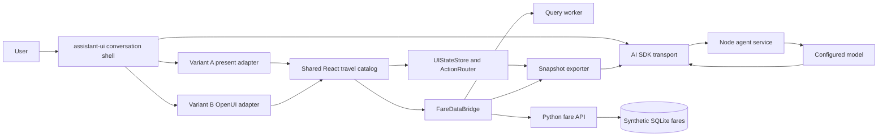

# Generative travel UI A/B implementation plan

LOCAL original alignment (2026-10-05): PR1 is actually MERGED into dev `3cec49f8b101d46049d633beaf032982d2439271`; this checkout deliberately integrates original967 with that reviewed dev source and preserves original carrier fixture and exact hook intent. Original merge checks pass280 Vitest/47files, strictTS/catalog/build and12 Python tests. The canonical checkpoint571 remains the full evidence authority; raw96 remains53 PASS/43 FAIL, with no post-fix rerun, optional unperformed human ratings/winner, and no further mobile work. Never push this original private ancestry. See `docs/status/generative-ui-ab-handoff.md` for durable current delivery status.

Status (2026-10-05): functional and aesthetic desktop engineering delivery is complete; both A/B remain runnable. Final277 Vitest/47 files,strictTS/catalog/build,12 Python and57 offline study/review checks pass. The frozen96-case diagnostic run completed53 PASS/43 FAIL; confirmed source/verifier defects were independently repaired afterward without changing raw outcomes or running a new96 batch. Human comparative ratings/winner selection are optional, unperformed follow-up; no winner is claimed. The latest user instruction excludes further mobile work and authorizes the reviewed finalPR1→dev merge plus originalLOCAL alignment. Current delivery readbacks and private artifacts remain LOCAL; see the current handoff/ledger and ignoredlatest-readiness, which supersede the historical status below.

Prepared on 2026-10-02 from local `dev` at `e6f718d`. The planning agent verified a clean checkout, a healthy local project graph, the current build, the backend tests, and the generated database. A future implementation run must repeat the startup checks because branches, dependencies, credentials, and framework APIs can change.

## Implementation and evidence status (2026-10-03)

Implementation started from `dev` at `dc14f22` in an isolated integration worktree. Separate A, B, and data/state branches were used; `dev` and `main` remain unmerged. All workers used the explicitly requested GPT-6.1 Sol. The runnable routes are `/a`, `/b`, `/generative`, `/study` and the preserved classic `/` search.

The shared spine implements strict versioned contracts, one forty-component descriptor vocabulary, native A and OpenUI B adapters, browser resource loading, stable references, a TypeScript query worker, revisioned host state, bounded tools, atomic current snapshots, descriptor-only IndexedDB persistence, and the three-process local launcher. Model-authored state initialization uses typed `edit_artifact` commands at an observed revision and waits for adjacent-leg coverage; explicit `create_artifact` allocates independent host-owned state. Direct controls remain local.

Both variants use signed-in local Codex `gpt-6.1-sol` with high reasoning. The app-server adapter forwards genuine agent-message deltas; it does not slice a completed response to simulate streaming. No separate API key is required. The isolated model subprocess has no shell, web, apps, plugins, MCP or delegation tools. The browser executes registered host tools. One invalid decision may receive one bounded repair from the original compact snapshot; cancellation prevents a repair. Provider token-usage accounting is unavailable and is recorded as null.

| Task family | Evidence and classification |
| --- | --- |
| Cheapest/fastest; train/bus | Real A composition and zero-chat Bus edits; bounded query oracles and engine benchmark |
| Price calendar | Real A calendar/ResponsiveGrid tree; deterministic shared calendar controls |
| Three cities/stays/mixed modes | Real local-fare browser proof: Paris stay2→3 moves second leg Oct11→12; outside date Oct20 yields Oct20/23; same-leg selection replacement, plus typed command and stale-load tests |
| Rearranged timeline | Real A RouteMap/ItineraryTimeline/Inline tree; native render replays |
| Text-only current state | Real Codex answer after local edit and reload: Bus, October 9, one selected fare; 30 genuine text deltas, no scene tool |
| Local filters/sort/date/selection | Native/B control tests; real Bus and fare selection with zero chat traffic |
| Outside coverage and stale work | Superseded load/query tests; scoped current-leg resource rebinding |
| Edits while streaming | Five native paused-stream browser cases; B host-hydration tests |
| Independent artifacts | Two restored native views share one dataset; second state and active ID remain independent; B isolation tests |
| Complete/partial reload | Descriptor-only persistence tests; real two-artifact selection/total reload proof |
| Cancel/invalid/repair/retry | Real Stop preserves the useful view; bounded parsers, single-repair regression tests and runtime retry controls |

Real A authorship produced three materially different recursive arrangements with no page errors or repair attempts. Each completed three HTTP200 model/tool continuation requests; completion times were 69.2, 66.1 and 53.1 seconds on this machine. The associated local Bus click made zero additional chat calls. The separate state proof replays a genuinely authored tree to isolate persistence, then makes a new live text-only call. These classifications are explicit in each evidence file. B produced two genuinely authored reactive graphs with complete tool and text-only continuations. Exact-source browser replays show nonempty mode aggregates, fare cards, a seven-day calendar and a timeline; original date-comparison failures are retained alongside their fix. Later user conversations exposed cumulative message IDs, repeated accepted scene continuations, terminal rendering, long Callout copy and restore/persistence failures. Exact sources and historical failures are retained; the corrections and final real completion checks are recorded in the continuation handoff.

At 50k and 200k rows, both TypeScript and DuckDB matched the declared workload oracles. TypeScript 200k query p95 was 353/261/313/375 ms for top-K/filter/group/join, with zero normal-query main-thread long tasks and worker cancellation acknowledgment at most 5.5 ms. DuckDB was faster for repeated large analytics. The production TypeScript worker meets the predeclared demo gates and avoids the 40 MiB WASM asset and separate cold startup. The optional 1M stress attempt was not run. See the exact thresholds, hardware, raw results and trace in `verification/generative-ui/query-engine-2026-10-02.md`.

`experiment:live` records selected or all twelve shared families in stable A/B or B/A order using runtime-seeded withheld wording, requests, snapshots, SSE events, traces and screenshots. Interaction/recovery families also need their deterministic tests and manual steps; a prompt-only run does not prove those actions. `/study?participant=anonymous-01` provides a local, anonymous, counterbalanced human review form with framework labels hidden. No human ratings have been fabricated or collected by an agent. Both variants remain runnable for this personal demo; selecting or removing one is unnecessary for completion.

The final full checks at frozen `a36f434` passed: 108 Vitest tests across 29 files, strict TypeScript, byte-exact catalog check, production build and 8 Python backend tests. Seven installed-Chrome responsive/classic-shell checks passed at the final revision. Root saved-chat reload preserves the current A/B IDs, source, preferences and selection. One additional genuine completion proof per variant passes; B reuses the exact captured source rather than generating a new graph. These are engineering checks, separate from real model completion and the formal study.

The user externally regenerated the preserved fixture to 10,000,000 fares. Its authoritative version is `sqlite-demo-v2-aa65e0b-5f489000-18dad574e0d82bc6`; health, metadata and searches agree. The read-only verifier confirms exact count, metadata count, route-day coverage, valid fares, integrity and indexes, then fails the newer source-manifest gate because this generator_version2 fixture lacks several newly listed destinations/routes/providers. No regeneration or silent data replacement was performed. Earlier evidence on the 1M fixture remains historical. Source-generation checks and descriptor migration preserve saved conversations while refreshing resources; temporary API failure offers retry and stale tabs cannot overwrite newer saved records.

The reported errors are fixed, verified and documented. The user requested stopping at this point. The full twelve-family cold/warm counterbalanced machine matrix and human ratings therefore remain outstanding for a later authorized session. Both variants stay available and no subjective or statistical winner is claimed. Current runtime, saved thread references, PRs, last completed gates and precise resume commands are recorded in the [continuation handoff](../status/generative-ui-ab-handoff.md).

## User-intent contract

Build two polished versions of the same conversational travel demo.

Both versions must provide a familiar agent chat with message history, a bottom composer, streamed text, streamed interactive UI, stop and retry behavior, useful loading and error states, and several live artifacts in a conversation. The agent may explain a result, generate an interactive view, continue with more text, generate another view, rearrange the current view on a later turn, create a separate artifact, or answer with text only.

The demo should feel designed for the user's request. It should not force every response through one fixed itinerary workspace. The shared catalog must contain granular layout elements and travel widgets that can form timelines, comparison boards, price calendars, route views, charts, filters, mode selectors, duration controls, offer lists, and compact summaries. Host React and CSS own visual quality, responsiveness, accessibility, and motion. The model chooses the arrangement and emphasis.

The browser owns downloaded fare rows and interactive UI state. A normal search loads a complete, bounded travel-data resource into the browser. Local controls filter, group, sort, select, and recompute synthetic totals without another model turn. The agent receives dataset manifests, compact UI state, small summaries, selected IDs, conversation history, and bounded tool results. Fare arrays, worker buffers, caches, and the million-row SQLite database never enter model context or generated component props.

The existing deterministic fare database is valid demo data. It need not represent live inventory or booking truth. It must remain internally coherent. Dates, routes, modes, carriers, durations, currency, passenger price rules, selections, and totals must agree with the loaded rows and declared coverage. Labels must say that fares and totals are synthetic.

The two versions differ at one deliberate seam:

- **Version A, component composition.** assistant-ui native `present` composes a recursive tree of registered React components. Trusted components own their local bindings and selector behavior. The model chooses components, props, variants, nesting, and actions.
- **Version B, authored reactive program.** The same chat shell hosts an OpenUI Lang artifact. The model authors variables, query dependencies, bounded QueryIR, conditions, aggregates, repetitions, and ordered actions. A closed browser provider executes the program over the shared FareDataBridge. Generated JavaScript, React source, SQL, URLs, and network tools are outside the language.

Both versions use the same model provider and configuration, fare fixtures, browser data engine, host stores, component implementations, design tokens, tool budgets, chat styling, tasks, viewports, and measurement code. Their prompts differ only where their scene languages require different instructions.

Implementation agents may propose new components, tools, selectors, QueryIR operators, and travel concepts when an observed task needs them. Each proposal needs a short typed RFC, a source or task example, boundary tests, a cost estimate, and a catalog-contract owner review. Expansion may not introduce full-dataset prompts, N+1 loops over fare IDs, hidden network access, duplicated state authority, or variant-only visual advantages in the A/B comparison.

## Fresh-context startup checklist

The orchestrator performs this checklist before creating a worktree or editing a file.

1. Read the repository `AGENTS.md`, this plan, [`browser-local-generative-ui-decision.md`](../research/browser-local-generative-ui-decision.md), `CONTRIBUTING.md`, `package.json`, and the current branch status.
2. Run `code-review-graph status --repo .`, then the MCP `get_minimal_context_tool`. Query `graphify-out/graph.json` before broad source reads. If source changed since the graph build, refresh the code graph. Use local or Codex semantic extraction for documentation.
3. Run `git status --short --branch`, `git log -5 --oneline`, `git remote -v`, and `git branch -vv`. Preserve unrelated work. Never assume the base commit printed at the top of this plan is still current.
4. Check `gh auth status` without printing tokens. At plan time the `ArdaOzd` account was active but its token was invalid. Authentication is required before the first authorized branch push or draft PR. It does not block local worktrees, implementation, commits, or tests.
5. Confirm the remote and branch policy. At plan time `origin` was `https://github.com/ArdaOzd/omio-gen-ui-demo.git`; routine PRs target `dev`; working branches use lowercase `feature/<name>`. Use live values if they differ.
6. Verify the baseline before feature work:

   ```sh
   npm install
   npm run build
   python3 -m unittest discover -s backend/tests -v
   python3 -m backend.verify_db data/omio.sqlite3 --expected-rows 1000000
   ```

7. Record Node, npm, Python, browser, operating system, current date, model provider, model name, reasoning setting, and package versions in the implementation ledger. At plan time the local runtimes were Node 22.16.0, npm 10.9.2, and Python 3.12.0.
8. Resolve and query current framework documentation through Context7 before pinning assistant-ui, AI SDK, OpenUI, Vitest, Testing Library, Playwright, the model provider, and any browser query engine. If Context7 is unavailable, record the failure and use first-party documentation and source. Do not edit Context7 configuration as a workaround.
9. Run the compatibility spikes in this plan before shared code depends on framework-specific APIs. Record actual package exports, streamed part shapes, continuation behavior, parse behavior, Vite compatibility, and failure modes.
10. Create or update the integration ledger. Each work package has one owner, an isolated worktree, explicit owned files, dependency commit, tests, branch, commit hash, pushed ref, draft PR URL, coverage result, and blocker or next step.

Startup is complete when the baseline is green, the exact base commit is recorded, shared contracts have one integration owner, every worker has a disjoint file list, and remote publication is either authenticated or explicitly marked pending.

## Current repository baseline

The current application is small. Preserve what is useful, and replace ownership where the new product requires it.

| Current path | Current responsibility | Constraint for implementation |
|---|---|---|
| `src/App.jsx` | Landing/results switch, startup metadata, one search, one abort controller | No chat, thread, artifact, durable store, or variant routing. Move orchestration into a typed app shell without rewriting working landing content first. |
| `src/api.js` | Location/search normalization, GET helper, query URL, local sort | Keep API normalization available during migration. New data loaders need complete coverage, stable IDs, abort and revision guards. |
| `src/components/SearchForm.jsx` | Origin, destination, dates, passengers, accessible suggestions | Reuse visual and accessibility behavior through typed adapters. It edits one origin-destination pair. |
| `src/components/ResultsPage.jsx` | Mode/date/sort/direct controls, selected fare, cards, route map | Mine it for components and design behavior. Its state is local to one result page and many control changes refetch. |
| `src/styles.css` | Complete Omio-style theme and responsive rules | Split only when ownership becomes clear. Shared A/B visual tokens and components must render identically. |
| `backend/app.py` | Dependency-free GET API for health, locations, metadata, and paginated search | Keep the fare-data boundary. It currently supports one outbound leg and optional reversed return, GET/OPTIONS only, limit 1 to 100. |
| `backend/tests/test_backend.py` | Six unittest cases for generation, source coverage, metadata, search, sorting, pagination, and invalid input | Extend when the data contract changes. Keep these regressions green. |
| `scripts/run.mjs` | Generates a missing database, starts or reuses the Python API, starts Vite, and terminates its own children | Add the agent service without killing a pre-existing API the script did not start. Track process ownership separately and stop only owned children. |
| `vite.config.js` | React plugin and `/api` proxy to port 8000 for dev and preview | Add a distinct agent-stream proxy. Avoid routing model requests through the fare API. |
| `verification/acceptance.md` | Human-written database, API, desktop, and mobile evidence | Retain as a dated evidence record. Add automated browser artifacts and a new dated run rather than rewriting old evidence. |
| `README.md`, `backend/README.md` | Local run instructions and fare API contract | Update only after the new commands and contracts work. |

Current `package.json` has React 19.2, React DOM 19.2, Vite 7, and no chat, model, state, TypeScript, lint, frontend unit-test, or browser-test dependency. The existing scripts are `dev`, `frontend:dev`, `build`, `preview`, `frontend:preview`, `seed`, and `start`.

The Python API exposes:

- `GET /api/health`
- `GET /api/locations`
- `GET /api/metadata`
- `GET /api/search`
- `OPTIONS` with permissive local-demo CORS

The current database is 158,183,424 bytes with 1,000,000 fares, 442 directional routes, 322,660 route-days, 63 companies, and 144 locations. The current seed happens to produce 3 to 12 rows for one origin-destination-date group, so a default 20-row page currently contains a complete one-day result. The API contract remains paginated. New loaders must prove coverage by page count or a new bounded export contract.

Baseline proof recorded while writing this plan:

- `npm run build` passed with Vite 7.3.6, 35 modules, 250.93 kB JavaScript and 20.00 kB CSS before gzip.
- all six backend unittests passed in 0.115 seconds;
- database verification passed for all counts above and `integrity: ok`;
- the checkout remained clean because `dist/` and the database are ignored.

No automated frontend unit, integration, accessibility, or browser suite exists. The browser evidence in `verification/acceptance.md` came from a live manual run and inspected desktop/mobile captures that were not persisted.

## End-state experience

The combined app exposes neutral routes `/a` and `/b`, plus a small root chooser for internal testing. The routes use the same query, thread fixture, design, and dataset when the experiment harness assigns a comparison. The visible product does not name its framework.

The minimum live task set is:

1. “Show the cheapest and fastest London to Paris options next week.” The response streams prose, a price calendar, mode facets, and offer choices.
2. “Compare train and bus visually.” The agent produces side-by-side summaries and a duration-price chart using the current filters.
3. “Plan London, Paris, and Barcelona with two and four-night stays.” The artifact shows the route, stay allocation, per-leg mode controls, selected fares, and a clearly labeled synthetic total.
4. The user changes a date, mode, carrier, duration, price range, sort, or selected fare. Covered data recomputes locally with no model request.
5. The user asks, “Show the same options as a timeline.” The next turn receives the latest compact state and reuses dataset references. It does not reload or prompt with fare rows.
6. The user asks a factual follow-up that needs no visual. The assistant answers with text only.
7. The user interacts with an older artifact. The app marks it active or forks it explicitly. Other artifacts do not mutate silently.
8. The user clicks while a response is streaming. The generated artifact binds current host state. Captured defaults initialize missing keys only and cannot overwrite the newer click.
9. A control moves outside cached coverage. The app shows pending or partial coverage, loads a bounded resource, cancels or supersedes the old request, and rejects late data by request and revision.
10. Reload restores messages, artifact source or tree, compact UI state, selected IDs, and resource descriptors. It reloads fare rows from those descriptors rather than storing them in the transcript.

Desktop, tablet, and mobile layouts must keep the composer, active controls, and current artifact usable. Keyboard users must be able to operate the composer, dates, filters, modes, charts with interactive affordances, fare selections, artifact activation, stop, retry, and error recovery. Focus must remain stable while text and UI stream.

## Shared architecture



The Python service remains the fare-data server. A separate Node service owns model credentials, the AI SDK stream, server-side tools, and per-turn budgets. The browser owns fare rows after bounded download, artifact state, local queries, direct actions, and request snapshot creation. assistant-ui supplies the conversation in both variants. Exactly one scene engine is active per variant.

### Shared contracts

Create the contracts before framework adapters. Use branded string types for IDs and runtime validation at network, model, persistence, and generated-program boundaries.

```ts
type DatasetId = string & { readonly __brand: "DatasetId" };
type DatasetRevision = number & { readonly __brand: "DatasetRevision" };
type ArtifactId = string & { readonly __brand: "ArtifactId" };
type UIStateRevision = number & { readonly __brand: "UIStateRevision" };
type FareId = string & { readonly __brand: "FareId" };

type Coverage = {
  originIds: string[];
  destinationIds: string[];
  dateWindow: { from: string; to: string };
  modes: Array<"train" | "bus" | "flight" | "ferry">;
  passengers: number;
  complete: boolean;
  truncated: boolean;
};

type DatasetManifest = {
  datasetId: DatasetId;
  revision: DatasetRevision;
  schemaVersion: string;
  coverage: Coverage;
  rowCount: number;
  fields: DatasetFieldManifest[];
  compactSummary: {
    minPriceCents?: number;
    maxPriceCents?: number;
    minDurationMinutes?: number;
    maxDurationMinutes?: number;
    modeCounts: Partial<Record<TransportMode, number>>;
  };
  source: {
    kind: "search" | "synthetic-fixture";
    descriptorId: string;
    sourceVersion: string;
  };
};

type ArtifactUIState = {
  artifactId: ArtifactId;
  revision: UIStateRevision;
  datasetRefs: DatasetId[];
  filters: TravelFilters;
  dates: TravelDateState;
  stays: StayAllocation[];
  modesByLeg: Record<string, TransportMode[]>;
  sort: SortSpec;
  selectedFareIds: FareId[];
  pending: PendingState[];
  lastInteractionAt: string;
};

type AgentContextEnvelope = {
  schemaVersion: string;
  turnId: string;
  activeArtifactId?: ArtifactId;
  artifacts: CompactArtifactSnapshot[];
  datasets: DatasetManifest[];
  selectedFareFacts: BoundedFareFact[];
};
```

The active artifact snapshot includes its current semantic layout or compact tree/program summary. Older large artifacts become short summaries. The snapshot exporter uses an allowlist, captures one atomic revision, applies a byte budget, and rejects row-shaped fields. The agent endpoint validates the envelope's schema, size, artifact IDs, dataset revisions, and selected IDs before adding it to model context. Request metadata is not considered model-visible until the endpoint explicitly accepts and injects it.

### Browser data and state

`FareDataBridge` is the only browser API that exposes fare resources to UI code. It owns dataset handles, coverage, row buffers, fetch/generation requests, cancellation, query execution, and bounded lookup. Components never receive a fare array prop.

```ts
interface FareDataBridge {
  load(request: CoverageRequest, signal: AbortSignal): Promise<DatasetManifest>;
  getManifest(datasetId: DatasetId): DatasetManifest;
  query(input: ValidatedQueryIR, signal: AbortSignal): Promise<BoundedQueryResult>;
  lookupFare(id: FareId, fields: AllowedFareField[]): Promise<BoundedFareFact>;
  subscribe(datasetId: DatasetId, listener: () => void): () => void;
  release(datasetId: DatasetId): void;
}

interface UIStateStore {
  get(artifactId: ArtifactId): ArtifactUIState;
  initializeMissing(artifactId: ArtifactId, defaults: Partial<ArtifactUIState>): void;
  dispatch(command: UICommand & { expectedRevision?: UIStateRevision }): DispatchResult;
  subscribe(artifactId: ArtifactId, listener: () => void): () => void;
  exportSnapshot(artifactId: ArtifactId): CompactArtifactSnapshot;
}
```

Direct actions update `UIStateStore`, then shared selectors or Version B queries recompute from `FareDataBridge`. A request outside coverage starts a load. It does not call the model. Every async operation carries `turnId`, `artifactId`, dataset revision, UI revision, query or request ID, and `AbortSignal`. Cancellation saves work; revision checks protect correctness.

Generated A and B payloads never hardcode the revision token used by repeated direct interactions. For each click or local query, the host `ActionRouter` or provider reads the current UI and dataset-generation revisions from execution scope, applies the action, and issues new guards. A model-proposed patch on a later turn may carry the snapshot revision submitted with that turn; the host validates it and rejects or visibly reconciles a mismatch.

Sending a message captures a UI revision. A streamed artifact subscribes to current state when it mounts. Generated defaults initialize absent keys only. Agent-proposed state changes include an expected revision. The action router applies a compatible patch or presents a visible reconciliation choice.

### Realistic data volume and query engine

The product path downloads bounded search windows, not the full SQLite file. A city-pair week can load each date through the current paginated API and mark coverage complete only after all pages arrive. A multi-city artifact owns one or more resources for its legs and windows. Dataset IDs are content-addressed or deterministically derived from normalized coverage plus schema version so equivalent artifacts can reuse them.

Add a bounded chunk/export API only if repeated paginated calls become the measured bottleneck. Keep any large fixture endpoint scoped by route/date scenario, capped, abortable, and explicit about completeness. The browser stress suite may generate or download deterministic 50,000, 200,000, and 1,000,000-row resources. Those stress resources test the engine and row boundary; they are not normal prompt context.

Define one `QueryEngine` interface and benchmark two worker implementations before choosing the production demo engine:

- a typed TypeScript worker with indexed rows or application-owned columns;
- DuckDB-Wasm with Arrow or Parquet ingestion and host-compiled parameterized SQL.

The model never emits SQL. Both variants emit or resolve validated QueryIR. Record cold and warm load time, index/build time, peak worker memory, p50/p95 query latency, cancellation latency, incremental append, main-thread long tasks, grouping/top-K/join behavior, and result-transfer size on 50k and 200k rows. Attempt 1M only on a supported target and report failure or memory pressure honestly. Set pass thresholds before the benchmark; do not claim performance until traces exist.

### Synthetic price and itinerary rules

Make the demo price rule explicit in the shared schema and UI. Recommended initial rule: database `price_cents` is a synthetic per-passenger fare including demo fees; a selected-leg subtotal is `price_cents * passengers`; an itinerary total is the sum of selected leg subtotals in EUR. Add `price_basis` and `synthetic` metadata to the API and tests. If implementation chooses a different rule, update the schema, fixture oracle, UI label, and tests in the same shared-contract commit.

Keep feasibility small and deterministic. Ordered stops define adjacent legs. Departure dates derive from the trip start and stay-night allocation. A selected fare belongs to one leg, dataset revision, and coverage descriptor. Fixtures use one recorded seed, stable city/route IDs, a declared Europe/Prague display clock unless a source supplies an explicit offset, EUR cents, and deterministic secondary ordering by departure then stable fare ID. Treat serialized ranks as derived positions, never as persistent identity. The same seed, source version, normalized query, and passenger count must yield the same rows in A and B. Basic chronological checks use the current local schedule semantics. Do not present the demo as a production connection, timezone, taxes, refund, inventory, or booking engine.

### Bounded agent tools

The shared agent loop exposes a small tool set. Browser tools run against the local bridge and return bounded facts to the server-side model continuation. A manifest result is reconstructed from a typed allowlist: dataset ID and revision, schema version, normalized coverage, row count, approved field descriptors, reload-source kind plus opaque descriptor ID, and the fixed summary fields above. It cannot add row samples, arbitrary source payloads, or open-ended summary keys.

| Tool | Contract |
|---|---|
| `load_fares` | Load or reuse one bounded coverage request. Return only a manifest and small summary. |
| `summarize_fares` | Return capped grouped aggregates over a dataset and filters. |
| `get_top_fares` | Return at most five IDs and compact facts for one objective. |
| `get_fare` | Return one fare with allowlisted fields. |
| `get_route` | Return compact route, location, and available-mode facts. |
| `find_carriers` | Return a capped carrier list for a route and modes. |
| `present` | Version A only. Native assistant-ui scene tool; the host validates refs and records the accepted tree after observing the tool part. |
| `compose_reactive_scene` | Version B only. Validate and stream one OpenUI program artifact. |

Enforce size and count limits per call and a server-owned budget per visible user turn. The server derives the budget key and cumulative use from validated message/run identity and accepted history, optionally backed by a short-lived server ledger. It never trusts a client-supplied remaining count. The budget survives frontend-tool continuation requests; a `stopWhen` counter that resets on each HTTP request is not sufficient. Reject repeated small calls that would enumerate the corpus into tool history. Strip bulk fare collections from logs, errors, telemetry, persistence, and repair prompts. Small bounded arrays remain valid where the contract requires them, including children, finite filter enums, selected IDs, and QueryIR operator lists.

Browser tools acknowledge a committed change with IDs, revisions, status, source kind, and a fixed bounded summary only. They never echo local view models, row samples, debug maps, or generated props. Gate 0 records native `present`'s actual result and verifies it is safe; do not wrap `present` merely to attach application data. Continue the tool loop only after the browser reports completion and the observable mounted refs have passed host validation.

### Chat, artifacts, and persistence

assistant-ui supplies the visible thread, ordered message parts, composer, stop, retry, branching, and Tool UI placement. The AI SDK transport adds the latest compact snapshot with `prepareSendMessagesRequest`. The Node endpoint validates the snapshot and streams ordered text and tool parts.

Persist messages, artifact records, compact UI state, dataset descriptors, program or tree source, revisions, and sanitized diagnostics in IndexedDB through a small repository-owned adapter. Keep row buffers and query results in worker memory or a separate data cache. A transcript export must omit them. Reload recreates stores, rehydrates compact fields, and reloads or regenerates resources from descriptors.

Show an **Active artifact** chip near the composer using the last-interacted artifact ID. The chip, atomic snapshot, and request active artifact must agree. Attachments use an explicit MIME allowlist plus count, per-file, and total-byte caps; reject raw fare exports, SQLite/database files, and row-shaped tabular attachments. Deterministically trim or summarize older tool-heavy history while retaining the current user turn, its frontend-tool continuation chain, active selected IDs, and compact summaries needed for coherence.

Historical message artifacts are immutable. A later turn can create a new program/tree revision for the active artifact, append a new artifact, or branch the conversation. Activating or forking an older artifact is explicit.

## Shared component and tool catalog

The catalog needs enough small pieces for visibly different compositions. The list below is a proposed starting vocabulary, not a product cap or a requirement to implement every export before the first slice. Treat related exports and variants as component families, keep the active prompt within its descriptor budget, and expand through the typed RFC path in the intent contract.

| Group | Initial components |
|---|---|
| Layout | `TravelHero`, `Section`, `Stack`, `Inline`, `ResponsiveGrid`, `SplitPane`, `StickySummary`, `Tabs`, `Carousel`, `Callout` |
| Trip structure | `CitySequence`, `RouteMap`, `ItineraryTimeline`, `LegHeader`, `StayAllocation`, `DateWindow`, `DurationBar` |
| Inputs | `ModeChips`, `CarrierFilter`, `PriceRange`, `DurationRange`, `DirectToggle`, `SortSelect`, `DateStrip`, `FarePicker` |
| Data views | `FareCards`, `ComparisonTable`, `ComparisonMatrix`, `PriceCalendar`, `PriceByDayChart`, `DurationPricePlot`, `ModeBreakdown`, `CarrierBreakdown` |
| Summary | `SelectedItinerary`, `SyntheticTotal`, `CheapestFastest`, `InsightBadge`, `CoverageSummary` |
| Status | `ArtifactSkeleton`, `CoverageNotice`, `EmptyState`, `InlineError`, `StaleBadge`, `RetryAction` |

The first vertical slice implements all layout primitives and status fallbacks plus the primary date, mode, filter, sort, fare list/card, price calendar, mode comparison, total, and coverage families, roughly 16 to 18 exported components after variants. Map, advanced charts, timeline, multi-city selection, and secondary summaries are the next extension set. Component count does not measure quality; the gate is that the current set supports the task without one fixed workspace.

Every component has one descriptor as the source of truth. A small idempotent generator reads descriptors and produces:

- the Version A Zod schemas and assistant-ui `present` registration;
- the Version B `defineComponent` definitions, stable positional argument order, refs, and `createLibrary` input;
- model-readable catalog documentation, examples, and active-catalog manifest;
- a manifest hash and catalog version stored with every artifact;
- contract fixtures proving both adapters expose the same visible capability where the A/B test requires equality.

Do not maintain two hand-written registries. The Version A output must itself be a compiler-valid `"use generative"` module with client component references only in inline `render` positions. If the pinned compiler prevents full generation, keep one explicit inline render map and make the generator fail unless its names, schemas, descriptions, and policies exhaustively match the descriptors. CI runs the generator in check mode and fails on a diff. Adding a Version B positional property is append-only within a catalog version. Reordering or removing a property requires a version change and an artifact migration or an explicit incompatible-history fallback. Persist each artifact's catalog, parser, scene-schema, and query-contract versions.

The active prompt receives base layout, status, and essential travel components plus task-relevant component descriptors within a fixed budget. Optional `describe_component` and `describe_tool` calls may return metadata and small examples. They never return rows. The agent may request an optional catalog group, but cannot invent a component name or load runtime code.

Version A and B share component implementations, colors, typography, responsive rules, motion, accessible names, keyboard behavior, focus management, skeletons, and error treatments. Their binding props intentionally differ:

- A wrappers accept registered scalar `artifactRef`, `datasetRef`, `bindingRef`, `stateRef`, `selectorRef`, and `actionRef` values plus bounded display variants. The host binding registry resolves state slices and selector arguments; the model never supplies a path or argument object.
- B components are mostly presentational. OpenUI queries and expressions supply their bounded computed props and bind supported input fields to `$variables`.

This difference must remain visible in the experiment. A must not accept arbitrary QueryIR hidden inside a selector prop. B must not collapse every task into fixed helpers such as `getCheapestWidget`.

Use an external chart, map, drag-and-drop, virtualization, animation, or accessibility library only after a focused spike verifies current license, peer versions, bundle impact, mobile and keyboard behavior, streaming mount behavior, and reuse in both variants. One new library should replace meaningful application work. Do not add a package for each widget.

## Version A: assistant-ui component composition

### Runtime choice

Use assistant-ui for the conversation and its native `present` generative UI for Version A. Use the AI SDK runtime and a custom transport to the shared Node service. Register the generated catalog from the shared descriptor source. Do not register OpenUI or json-render as a second tree engine in this condition.

Gate 0 resolves the following compatibility candidate as one set: `@assistant-ui/react`, `@assistant-ui/ai-sdk`, `@assistant-ui/vite`, `@assistant-ui/react-generative-ui`, `ai@^7`, `@ai-sdk/react@^4`, the selected AI SDK provider package, and `zod`. Exact patch versions are locked together only after the spike passes. Browser frontend executors use the required leading `"use client"` directive. The Node route imports the resolved `frontendTools` API from `@assistant-ui/ai-sdk` and uses the current AI SDK native Node UI-message stream response method proved by the spike.

The Gate 0 candidate topology uses the assistant-ui Vite compiler with `aui({ backendless: true })`. The browser registers the generated toolkit through the resolved `AuiConfig` and `Tools({ toolkit })` APIs under `AssistantRuntimeProvider`. It keeps `present` and the bounded browser tools frontend-executed. `AssistantChatTransport` forwards their schemas, and the Node route reconstructs approved frontend schemas with the resolved `frontendTools(tools)` API for the AI SDK v7 `streamText` loop. This choice avoids assuming that a separately compiled Node process can import the Vite compiler's server half. Gate 0 must inspect actual package exports, request fields, and tool schemas before this topology becomes a dependency.

One `present` call produces one recursive root through the current `JSONGenerativeUI` candidate. Several independent UI blocks in one visible assistant turn use repeated frontend-tool steps. Gate 0 tries the documented `lastAssistantMessageIsCompleteWithToolCalls` client predicate and sends a completed `present` result back to the server. The server uses the current `stepCountIs(N)` candidate for one `streamText` request while separately enforcing the cross-POST turn budget. The native Node route tries the current `pipeUIMessageStreamToResponse` response path. Ordered assistant-ui message parts preserve text and tool placement.

Pin package versions only after a compatibility spike proves these current behaviors in Vite:

1. custom `defineGenerativeComponents` entries generated from the descriptors;
2. one recursive root with stable child keys;
3. custom component `streamProperties: true`, partial props, and status behavior;
4. `$action` resolution through `ActionRegistry`;
5. ordered text, tool UI, text, and second tool UI through frontend-tool continuation;
6. custom AI SDK transport and request-time compact snapshot;
7. abort, retry, branch, persistence adapter, and error rendering;
8. tree and action validation when component, binding, dataset, or revision references are invalid.

The spike also proves that `prepareSendMessagesRequest` preserves the transport's existing messages, system fragment, uploaded tool schemas, IDs, triggers, and metadata while adding `currentContext`. If direct composition drops any forwarded field, build a small transport decorator around `AssistantChatTransport`. Do not replace it with a generic transport that silently loses assistant-ui tool forwarding.

Uploaded frontend schemas and client capability metadata are untrusted input. The Node route accepts only known tool names, known catalog version and hash, allowed JSON Schema features, bounded descriptions, and a maximum serialized size. It may reconstruct approved frontend tools, but it never turns a browser-supplied name into a server-executed function. Frontend tool failures return bounded codes and reference IDs without row data or internal stacks.

assistant-ui interaction logs are diagnostic only. They do not carry state into the next model turn. `UIStateStore` and the request snapshot remain authoritative. The first implementation should not depend on experimental Interactables.

### Tree contract

The generated schema should resemble this application contract after catalog generation:

```ts
type StoredPresentArtifact = {
  artifactId: ArtifactId;
  treeRevision: number;
  uiStateRevisionAtRequest: UIStateRevision;
  catalogVersion: string;
  datasetRefs: DatasetId[];
  root: PresentNode;
  layoutSummary: string;
};

type PresentNode = {
  key: string;
  $type: RegisteredComponentName;
  variant?: RegisteredVariant;
  datasetRef?: DatasetId;
  bindingRef?: RegisteredBindingRef;
  stateRef?: RegisteredStateRef;
  selectorRef?: RegisteredSelectorName;
  actionRef?: RegisteredActionRef;
  children?: PresentNode[];
};
```

`StoredPresentArtifact` is the host's persistence record, not an extra object the model sends through native `present`. Allocate an artifact first; the native root receives its scalar `artifactRef` and other registered scalar refs. The native payload remains the recursive component tree produced by the pinned assistant-ui compiler. P00 records its exact payload and result. After the tool part arrives, the host validates the observable tree and records artifact/revision/catalog/dataset metadata alongside it. The application validation pass checks tree depth, node count, child keys, dataset coverage, registered scalar refs, bounded styling variants, and catalog version. Generated props contain no arbitrary object bags, state paths, selector expressions, or action maps. Unknown names may be dropped by the renderer before host code can inspect them, so P00 determines the observable validation boundary. Invalid or unresolved refs render a stable placeholder or retain the last valid frame; do not claim an interception hook that the pinned runtime does not expose.

### Local bindings and actions

A exposes named selectors such as `visibleFares`, `priceByDay`, `modeCounts`, `carrierCounts`, `cheapestFastest`, `selectedItinerary`, and `syntheticTotal`. Each selector accepts a bounded typed argument schema stored in the host binding registry and returns a capped view model. Generated components subscribe through a scalar ref:

```ts
useTravelBinding(bindingRef)
dispatchTravelAction(actionRef, artifactId, payload, expectedRevision)
```

The model decides which selector-backed components to combine and how to arrange them. Application code owns reactive meaning. A direct input dispatches a registered action, changes compact state, and recomputes every subscribed sibling locally.

Persist the validated tree, compact state, dataset refs, tree/catalog versions, and layout summary. Do not persist selector results or fare rows. On reload, validate versions, hydrate compact state, reload datasets, and render. If a saved tree is incompatible, keep its prose and layout summary and show a clear regenerate action.

Enable `streamProperties: true` only for layout and status components that prove they can render `Partial<P>` plus `$status`. Controls, selections, charts, maps, totals, and other stateful views wait for complete validated props initially. A streaming-safe layout shows a deterministic skeleton until its required refs arrive. Completing a streamed prop set may initialize missing keys but cannot reset current UI state.

### Version A proof

A is ready for comparison when a live model can generate at least three materially different arrangements from the same catalog, stream usable partial UI, preserve a click made during streaming, update all bound components locally, rearrange the active artifact on the next turn, and pass request/transcript inspection with zero fare-row leakage.

The generated A prompt contains this normative core:

> Compose a visual story from registered components and scalar refs. Use `TravelSurface` as one recursive root. Use only dataset, artifact, binding, state, selector, action, theme, and recipe refs returned by tools; never copy fares, chart points, option arrays, styles, code, URLs, or selector expressions into props. Choose granular sections and views that fit the user's request instead of repeating one workspace. Preserve the current artifact and selected state when rearranging it. Use `present` only when direct interaction or visualization helps; otherwise answer in text. Respect coverage and visible-turn budgets.

## Version B: agent-authored reactive wiring

### Runtime choice

Use the same assistant-ui shell and AI SDK transport. Use OpenUI Lang v0.5 through `@openuidev/react-lang` as the only generated scene engine in Version B. A custom assistant-ui Tool UI implements `compose_reactive_scene` around `OpenUIContent` or `Renderer`. Reuse useful instruction and toolkit helpers from `@openuidev/assistant-ui`, but do not assume its stock continuation behavior.

Current first-party documentation says stock `present_openui` is a final display and does not automatically continue. The `/ai-sdk` helper continues `prompt_openui` human-input flow only. The custom scene adapter returns `{ artifactId, programRevision, status }` without query rows. Shared client `sendAutomaticallyWhen` logic and server `stopWhen` continue the visible turn while the cross-request turn budget remains. The compatibility spike must prove this exact path before B feature work.

One artifact contains one OpenUI program and one root. One assistant message may contain prose and several separate program artifacts as ordered tool parts. Do not put the entire assistant answer into an OpenUI text component to imitate chat.

### Program and artifact contract

```ts
type ReactiveArtifactRecord = {
  artifactId: ArtifactId;
  programRevision: number;
  uiStateRevisionAtRequest: UIStateRevision;
  uiStateRevision: UIStateRevision;
  catalogVersion: string;
  parserVersion: string;
  queryContractVersion: string;
  source: string;
  sourceHash: string;
  datasetRefs: DatasetId[];
  queryDescriptors: ValidatedQueryIR[];
  normalizedProgram: {
    declaredVariables: string[];
    queryDependencies: Array<{ queryId: string; variableNames: string[] }>;
    actionTargets: Array<{ actionId: string; stateRefs: string[] }>;
    descriptorRefs: string[];
  };
  persistedFields: CompactUIState;
  layoutSummary: string;
  diagnostics: SanitizedDiagnostic[];
  status: "streaming" | "ready" | "partial" | "error" | "stale";
};
```

The allowed program includes registered components and refs, JSON-compatible `$variables`, documented expressions, bounded pure aggregates and transforms, capped `@Each`, top-level local `Query`, explicit `Mutation`, and ordered `Action` steps with `@Run`, `@Set`, and `@Reset`. Queries whose arguments reference `$variables` rerun when those variables change. Mutations run only through a user or host action.

Reject generated JavaScript, React source, imports, dynamic components, `eval`, `Function`, raw SQL, arbitrary regex, unregistered tools, generated URLs, network access, periodic refresh, program-supplied fares, unbounded repetition, and generic mutations over data or credentials. Treat OpenUI as a closed parsed language plus application validation, not a general sandbox.

### QueryIR

B authors a bounded query graph over manifest-declared fields. It does not choose from a list of prewired widget queries.

```ts
type QueryIR = {
  version: 1;
  sources: Array<{ datasetRef: DatasetId; alias: string }>;
  where?: PredicateTree;
  project?: AllowedField[];
  groupBy?: AllowedDimension[];
  metrics?: Array<{
    as: string;
    op: "count" | "sum" | "min" | "max" | "avg";
    field?: AllowedNumericField;
  }>;
  orderBy?: Array<{ field: string; direction: "asc" | "desc" }>;
  topK?: { k: number; by: string; direction: "asc" | "desc" };
  joins?: Array<{
    rightAlias: string;
    leftKey: AllowedJoinKey;
    rightKey: AllowedJoinKey;
    kind: "inner" | "left";
  }>;
  limit: number;
};

type PredicateTree =
  | { all: PredicateTree[] }
  | { any: PredicateTree[] }
  | {
      field: AllowedFilterField;
      op: "eq" | "neq" | "in" | "gte" | "lte" | "between" | "contains";
      value: JsonScalar | JsonScalar[];
    };
```

`JsonScalar` is string, finite number, or boolean; null is allowed only when a declared field is nullable. `in` accepts a bounded scalar list and `between` exactly two ordered compatible scalars. `contains` is limited to declared text fields. `all` and `any` are nonempty, predicate depth is at most three, and total leaves are at most 16. The schema derives from the current dataset manifest. Validation rejects unknown fields, operator/type mismatches, excessive predicate depth, excessive metrics or groups, unsupported joins, output aliases that shadow reserved names, and estimated result or join expansion over budget. Host code compiles valid QueryIR into the chosen worker engine. Even a DuckDB implementation accepts host-compiled parameterized SQL only.

OpenUI's `toolProvider` is a closed function map over `FareDataBridge`, `UIStateStore`, and `ActionRouter`:

- `local_query` executes one validated, bounded QueryIR;
- `lookup_fares` returns allowlisted facts for selected IDs;
- `coverage_request` asks the bridge for an approved scoped resource and returns its manifest;
- `patch_artifact_state` applies revision-checked compact state operations.

The provider owns no general `fetch`, storage, socket, or network client. The adapter must keep capped query results renderer-local and exclude them from messages, snapshots, persistence, and repair context. Values observed through `onStateUpdate` are one input to the whitelist, not the authoritative state bridge. The docs do not promise query-result exclusion or complete state export, so integration tests must inspect real assistant-ui requests, stored messages, artifacts, errors, and replay logs.

OpenUI's documented `onStateUpdate` hook must not be assumed to capture every `$variable`, `@Set` action, toggle, or selected offer. Gate 0 exercises `useStateField` edits, internally handled `@Set` and `@Reset`, query-dependent toggles, selected-fare mutations, hydration, and program patches. Each user-visible input and action must reach the host `UIStateStore` and next-turn snapshot. The shared controls and typed action bridge are authoritative. Persist a normalized dependency/program summary and descriptor refs rather than a runtime-private AST that may change between patches. If the public runtime lacks a required hook, implement a small repository-owned adapter or a pinned, reviewed upstream patch or fork. Never patch `node_modules`, scrape renderer text, or use regular expressions as a language parser. The fallback must preserve genuine Version B dependencies and local reactivity.

### Static and runtime limits

Start with explicit conservative caps and tune them through evidence: 120 statements, AST depth 12, 256 expression nodes, six queries, two mutations, two concurrent local queries, 16 predicate leaves, predicate depth three, two grouping dimensions, six metrics, two declared-key joins, 200 returned rows, top-K 50, 50 rendered `@Each` items, 64 KiB serialized result, and one repair attempt. The shared visible-turn budget starts at four model/tool continuation steps.

The query planner estimates scans, groups, joins, result size, and render count before execution. It refuses an over-budget query rather than silently sampling. Every query is abortable and revision checked.

### Guidance and repair

Generate B instructions from the same versioned component and tool descriptors used by the runtime. Include the QueryIR grammar, manifest fields, caps, state-preservation rule, text-only rule, and a small set of examples for shared variables, grouped charts, conditional coverage, repeated top-K results, multi-leg selections, and revision-checked mutations.

The prompt must state the working procedure, not merely describe syntax: inspect the manifest before naming fields; declare shared variables before queries that depend on them; bind controls to those variables; use top-level queries for automatic dependency reruns; use mutations only from explicit actions; cap every repeated result; preserve current variables and selected IDs when rearranging an artifact; request new coverage only for a demonstrated gap; emit ordinary assistant text outside the program; and stop after a useful view rather than consuming the continuation budget. Examples must show the same component arranged with different dependency graphs and include an invalid full-row or raw-SQL counterexample.

The generated B prompt contains this normative core:

> Author a dependency graph, not fare data. Use only fields declared by the supplied manifests and only the QueryIR operators in this catalog. Share `$variables` across input bindings and query arguments so local edits recompute the dependent views. Prefer bounded projections and aggregates to row lists. Preserve dataset refs, current variables, filters, and selected IDs when editing an existing artifact. Do not emit JavaScript, SQL, URLs, network calls, copied rows, or invented travel facts. Respect query, render, and visible-turn budgets; return ordinary assistant text when no interface helps.

Stream source through a provisional parser and render only a valid reachable frame. Retain the last valid frame if a later chunk is invalid. Validate program and queries before a tool runs. After the stream settles, allow one repair using sanitized statement IDs, codes, allowed fields, and revisions. Never include query rows in a repair prompt. If repair fails, retain prose and show a stable retryable artifact error.

### Version B proof

B is ready for comparison when a live agent changes the actual program AST and dependency graph for two tasks using the same components and data engine. A withheld prompt must cause different grouping, QueryIR, variable dependencies, conditions, and ordered actions rather than different props on a fixed widget. Direct variable edits must rerun local queries without a model turn. The request and persistence audit must contain zero fare rows.

## Exact repository change map

The names below are the intended ownership map. The contract owner may refine a filename during the foundation PR, but must update this plan's implementation ledger before another worker depends on it. New stateful code is TypeScript. Existing JSX moves only when the integration requires it.

This plan deliberately uses `src/generative/**` as the feature root because these modules serve both the existing search app and the new A/B routes. Do not also create a parallel `src/demo/**` tree. If the integration owner changes the root name before P01, record the decision and migrate the complete map in one commit.

```text
agent/
  server.ts                    native Node HTTP entry and health endpoint
  chat-route.ts                validated AI SDK UI-message stream
  request-schema.ts            body, snapshot, tool-schema, and byte limits
  model.ts                     provider/model factory from environment
  prompt.ts                    common policy plus one variant fragment
  context.ts                   accepted snapshot to explicit model context
  turn-budget.ts               cross-request visible-turn ledger/reconstruction
  errors.ts                    sanitized streaming failures

src/generative/
  contracts/
    ids.ts                     branded IDs and revisions
    fare.ts                    normalized fare and price-basis schemas
    coverage.ts                bounded resource descriptors and completeness
    dataset.ts                 manifest and reload source
    query-ir.ts                closed query language and cost estimate
    artifact.ts                tree/program and UI-state records
    snapshot.ts                allowlisted model envelope
    tools.ts                   bounded browser tool schemas
    catalog.ts                 canonical component descriptors
    versions.ts                persisted schema and migration versions
  core/
    external-store.ts          useSyncExternalStore-compatible core
    abort-registry.ts          cancellation by artifact/resource/query
    budgets.ts                 row, byte, AST, render, and turn limits
    diagnostics.ts             sanitized boundary errors
  data/
    fare-data-bridge.ts        resource-only browser API
    resource-loader.ts         page exhaustion, coalescing, and coverage
    search-client.ts           typed wrapper over the Python GET API
    synthetic-source.ts        deterministic scenario expansion
    cache.ts                   row chunks and descriptors outside chat records
    normalize.ts               migration seam from src/api.js
  query/
    protocol.ts                main-thread/worker messages
    worker.ts                  indexed data and query execution
    worker-client.ts           revisions, aborts, and subscriptions
    query-engine.ts            benchmarkable engine interface
    selectors.ts               Version A named selectors
    query-ir-compiler.ts       Version B IR validation and host compilation
  state/
    ui-state-store.ts          per-artifact compact state
    artifact-store.ts          active/last-interacted and revisions
    action-router.ts           one typed direct-edit path
    snapshot-exporter.ts       atomic, byte-bounded next-turn state
    persistence.ts             IndexedDB records and migrations
  chat/
    runtime-provider.tsx       assistant-ui runtime and toolkit registration
    transport.ts               snapshot-aware AssistantChatTransport
    history-adapter.ts         persisted thread messages
    thread-shell.tsx           composer, messages, tool parts, stop/retry
  tools/
    executors.ts               bounded browser frontend-tool implementations
    projectors.ts              model-visible typed result allowlists
    budgets.ts                 per-call and cumulative enumeration guards
  catalog/
    descriptors.ts            only hand-edited component source of truth
    generate.ts                idempotent A/B/docs/manifest generator
    generated/                 checked generated schemas and manifest
    context.tsx                artifact, store, data, and action providers
    tokens.css                 shared high-quality themes and states
    layout/                    layout primitives
    controls/                  local input components
    views/                     charts, map, lists, calendar, timeline, totals
    status/                    loading, partial, empty, error, stale
  variants/a/
    toolkit.tsx                the small `"use generative"` module
    component-library.tsx      explicit inline render registrations
    bindings.ts                refs to selectors/actions/store
    prompt.ts                  tree language and examples
  variants/b/
    library.ts                 OpenUI component definitions and stable order
    renderer.tsx               program renderer and host provider
    tool-ui.tsx                custom continuation-aware Tool UI
    state-adapter.ts           public-hook proof or owned adapter
    prompt.ts                  program/query grammar and examples
  experiments/
    assignments.ts             stable A/B and B/A ordering
    scenarios.ts               shared task definitions
    metrics.ts                 timings, counts, errors, request sizes
    recorder.ts                generated tree/program and trace archive

benchmarks/query-engine/       50k/200k/optional 1M runners and reports
tests/                         contract, state, worker, stream, leakage fixtures
e2e/                          Playwright tasks, accessibility, and screenshots
verification/generative-ui/    dated human and live-model evidence
docs/decisions/                compatibility and query-engine decisions
docs/implementation/           single-writer progress ledger
```

The integration owner alone edits `package.json`, `package-lock.json`, `vite.config.*`, `scripts/run.mjs`, root entry/routing files, shared contract names, decision records, the ledger, and tracked graph artifacts. Proposed script additions are:

```json
{
  "agent:dev": "run the TypeScript agent service in watch mode",
  "typecheck": "check new TypeScript projects without emitting",
  "test": "run deterministic unit and integration tests",
  "test:browser": "run Playwright acceptance",
  "test:leakage": "inspect recorded requests, tool results, and persistence",
  "benchmark:query": "run the recorded query-engine matrix",
  "check:catalog": "regenerate to a temp area and require no diff",
  "check": "typecheck, unit tests, catalog check, build, and Python tests"
}
```

Do not choose the exact command implementation or package versions from this prose. Gate 0 resolves current official APIs and commits the working commands. `npm run build`, `python3 -m unittest discover -s backend/tests -v`, and database verification remain part of the full check.

Changes to `backend/app.py` should remain narrow. Add explicit price-basis metadata and, only if measurement justifies it, a bounded route/date-window export. Keep existing endpoints compatible. Extend `backend/tests/test_backend.py` for any new field, completeness marker, cap, or endpoint. Do not move model credentials or agent behavior into Python.

## A/B comparison protocol

The purpose of the comparison is to decide which representation gives the best adaptive, polished travel experience with reliable local behavior. A one-point aggregate score is not a decision. The top candidates are close enough that observed behavior wins.

### Controlled conditions

For each comparison pair, hold constant:

- provider, model, reasoning setting, sampling parameters, and supported seed;
- shared system policy, user prompt, compact context, tool facts, turn and byte budgets;
- dataset source, normalized rows, cache state, coverage, synthetic seed, passenger count, and current UI state;
- host components, theme, CSS, animation, icons, copy conventions, viewports, and accessibility behavior;
- browser and machine, network shaping, cold or warm label, and recording method;
- repair budget and maximum visible-turn continuations.

Only the scene-language instructions and adapter differ. Version A receives tree components, selector refs, and action refs. Version B receives OpenUI syntax, QueryIR, variables, mutations, and actions. B does not get more data, a hidden second layout model, or extra components. A does not hide general reactive expressions inside an opaque selector argument.

Use counterbalanced A/B and B/A orders. A model at temperature zero is not guaranteed deterministic. Record each generated tree or program, tool call, request size, accepted compact snapshot, model setting, package version, cache condition, and screenshot. A deterministic replay can reproduce renderer and interaction behavior from those records. It cannot substitute for the live model's ability to author the artifact.

### Task suite

Run both variants through the following fixed tasks plus one withheld wording for each task family:

1. cheapest and fastest options for one route and date window;
2. a visual train-versus-bus comparison;
3. a cheapest-date price calendar with facets and offers;
4. three cities, mixed modes, and different stay lengths;
5. the same options rearranged as a timeline on the next turn;
6. a later text-only answer using current selected state;
7. filters, sorting, an in-coverage date, and fare selection with no chat request;
8. an out-of-coverage date while an older fetch resolves late;
9. a user edit while the assistant streams a replacement layout;
10. two artifacts that share datasets but retain independent UI state;
11. reload after a complete artifact and after partial coverage;
12. cancellation, invalid generated output, one bounded repair, and retry.

The withheld B tasks must alter the actual program dependency graph, grouping, conditions, and action sequence. Changing labels on a preset layout does not count as reactive authorship. The withheld A tasks must produce materially different recursive compositions from granular components. Reordering one fixed workspace does not count as adaptive composition.

### Hard gates

Both variants must pass these gates before preference scoring:

1. A live configured model generates a valid artifact, uses bounded tools, and produces ordered text and UI. Fake providers may test protocol plumbing but do not pass this gate.
2. Direct controls update current local views and totals without `/api/chat` traffic.
3. The next text turn contains the latest compact state, and the endpoint explicitly injects its validated form into model context.
4. No full row or sentinel field appears anywhere in model requests, nested historical tool input/output, generated props/program literals, repair context, exported UI state, persisted chat, or model-visible diagnostics.
5. Stale dataset/query responses and streamed defaults cannot overwrite a newer browser edit.
6. Parsing and repair are bounded. An invalid generation leaves stable prose and a useful artifact error.
7. The selected query engine meets thresholds defined from an initial profile at 50k and 200k rows on the target hardware. Record 1M as an optional honest stress attempt rather than a product promise.
8. Phone, tablet, desktop, keyboard-only, screen-reader labels, focus retention, reduced motion, and basic automated accessibility checks pass the shared tasks.
9. Reload restores messages, descriptors, artifact source, compact state, and version metadata without copying row buffers into the transcript.
10. Version B proves every editable input, `$variable`, action-driven state change, toggle, and selected fare reaches the host snapshot using the resolved public API or the recorded owned-adapter fallback.

If a live provider key is unavailable, complete deterministic protocol and browser work, then leave the live gates explicitly pending. Do not declare the A/B decision complete from mocks or screenshots alone.

### Measures and decision record

Measure task success, invalid output, repair success, time to first text, first valid UI, first usable control, task completion, direct interaction-to-paint, worker query p50/p95, cancellation latency, context bytes, token use, model steps, frontend-tool continuation requests, AST/tree size, main-thread long tasks, worker memory, cache load, bundle size, and regression count.

Rate visual quality, usability, creativity, information hierarchy, mobile adaptation, and perceived responsiveness separately through blinded captures and hands-on tasks. Preserve short reviewer notes explaining the rating. Report the engineering metrics next to the subjective scores. Do not average them into a false-precision winner.

The final decision record names the chosen variant, rejected tradeoffs, unresolved provider variance, exact artifacts reviewed, and whether the result applies to the demo only. A can win through simpler native React composition and reliable ordered message parts. B can win if genuine authored dependencies produce better useful adaptation without unacceptable grammar and state-bridge failures.

Framework names, route labels, and debug traces stay out of the blinded product view. A developer-only experiment toolbar may reveal the assigned variant after a task or in a separate debug mode. Both `/a` and `/b` remain directly addressable for engineering and automated tests.

Experiment logs, replays, traces, screenshots, and ratings stay local to the repository evidence workflow. Use anonymous participant IDs and do not add external analytics. If a later study needs publication or identity-linked data, define that separately before collection.

## Verification strategy

### Contract and privacy-boundary tests

- Parse branded IDs, versions, coverage, tool input/output, trees, programs, snapshots, and persisted records at their boundaries.
- Generate A and B adapters from one descriptor source, run the generator twice, and require byte-identical output.
- Reject fare arrays, unknown keys, raw objects in generated component props, HTML, CSS, JavaScript, URLs, SQL, unregistered components/actions/tools, and oversize strings.
- Seed rows with unique sentinel keys and values. Inspect serialized transport bodies, message history, every nested tool field, generated artifacts, repair requests, logs intended for the model, and IndexedDB chat records.
- Permit one `get_fare` fact and the configured top-K facts. Fail repeated bounded calls that cumulatively enumerate a dataset past the per-turn budget.
- Prove snapshots are atomic, deterministic, revisioned, byte-capped, and limited to the current artifact plus bounded summaries.

### Data, query, and state tests

- Exhaust search pages according to response metadata. Mark completeness only after exact coverage exhaustion.
- Test partial budgets, retry, deduplication, conflicting IDs, coalesced loads, abort, late pages, stale revisions, and corrupt cache fallback.
- Compare each Version A selector and each Version B QueryIR operation with a simple reference implementation on small fixtures.
- Test deterministic ties, aggregates, top-K, filters, groupings, declared-key joins, result caps, and rejected cost estimates.
- Test multi-city adjacent-leg resources, stays, mixed modes, candidate bounds, selection totals, and basic chronology.
- Prove every direct action increments the right artifact revision, updates subscribed siblings, and never calls the model.
- Test current-state wins while streaming: initialize absent keys, reject or visibly reconcile incompatible expected revisions, and retain the latest click.
- Reuse one rendered control for two clicks across a state revision and accept the second with the execution-scope revision. Then deliver an older model or query patch and reject or visibly reconcile it. Apply the same current-token rule to QueryIR cancellation and stale-result guards.
- Test independent artifacts, explicit old-artifact activation/forking, persistence migration, incompatible catalog/program versions, and descriptor-based reload.

### Stream and component tests

Use Vitest and Testing Library if Gate 0 confirms current compatibility. Use deterministic fake-model streams for text, tool input, browser result, continued text, a second scene, cancellation, retry, maximum steps, invalid schema, and late results. Assert rendered part order and that stateful controls mount only from complete valid props unless explicitly designed for partial streaming.

Each shared component gets ready, loading, partial, empty, error, stale, and invalid-ref coverage where applicable. Test keyboard operation, labels, focus, live regions, reduced motion, responsive collapse, and current-state subscription. Avoid snapshots that merely restate markup. Keep stable visual screenshots for themes, recipes, complex artifacts, and failure states.

Use Playwright for the fixed workload, network inspection, direct-edit no-chat assertion, slow and out-of-order API responses, reload, two-artifact isolation, phone/tablet/desktop, keyboard, automated accessibility, and screenshot capture. A real browser trace is required for performance claims.

### Repeatable commands

Every PR body lists the exact commands it ran. The target full suite after the scripts exist is:

```sh
npm run typecheck
npm test
npm run check:catalog
npm run build
python3 -m unittest discover -s backend/tests -v
python3 -m backend.verify_db data/omio.sqlite3 --expected-rows 1000000
npm run test:leakage
npm run test:browser
npm run benchmark:query
```

Run the smallest relevant commands during a package, then the full integration suite before pushing the integration branch and before updating the final comparison evidence. Browser tests must report the browser version and assigned ports. Benchmarks must report hardware, row count, cache condition, sample count, and timestamp rather than presenting the plan date as a result.

## Phased implementation DAG

The sequence below is outcome-oriented. A phase exits with behavior and evidence, not merely files.

### Phase 0: compatibility and shared contracts

1. **P00, framework compatibility.** The integration owner temporarily proves assistant-ui/AI SDK/Vite schema upload, snapshot-preserving transport, native `present` continuation, OpenUI parsing/rendering, the custom `compose_reactive_scene` continuation, and B state capture. Commit a short decision with the resolved package tree and observed request/part shapes. Exit when both minimal scenes render and the current app still builds.
2. **P01, contract spine.** Define IDs, fare/price basis, coverage, manifests, artifacts, state, QueryIR, tools, budgets, snapshots, and versions. Add sentinel leakage helpers. Exit when boundary tests pass and both variant adapters can depend on one package.
3. **P02, canonical catalog lever.** Define descriptors and the idempotent generator for A schemas, B ordered definitions, prompt docs, examples, manifest hash, and contract fixtures. Exit when check mode has no diff and a deliberate descriptor change updates all expected products.
4. **P03, tooling foundation.** Add TypeScript, unit-test, browser-test, and catalog-check configuration. The integration owner chooses exact packages after current documentation and compatibility verification. Exit when one contract test, one DOM test, one fake stream, and one browser smoke run in the worktree.

P00 is blocking. P01 and the first form of P02 can overlap after P00 records package APIs. The integration owner resolves all shared-name changes.

### Phase 1: browser-local application spine

1. **P10, resources and coverage.** Implement `FareDataBridge`, typed search client, page exhaustion, deterministic synthetic source, manifests, coalescing, cancellation, and reload descriptors. Exit on paging and stale-response tests.
2. **P11, query engine decision.** Implement the common query interface and enough of the TypeScript worker and DuckDB-Wasm candidate to run the benchmark matrix. Record the choice; delete the losing production adapter after retaining benchmark evidence. Exit when the selected engine passes correctness, cancellation, and 100k/200k thresholds.
3. **P12, state and action spine.** Implement per-artifact stores, revisions, actions, atomic snapshot exporter, persistence schemas, and current-state-wins behavior. Exit when direct mutations, two-artifact isolation, snapshot limits, and reload pass.
4. **P13, bounded browser tools.** Implement manifests, summaries, top five, single fare, route, carriers, and tool budgeting over the shared bridge. Exit when outputs are capped and leakage tests prove no enumeration.

P10, P11, and P12 work from P01 contracts in separate paths. P13 waits for their stable public interfaces.

### Phase 2: shared experience and chat

1. **P20, visual system.** Implement shared tokens, two polished theme candidates, responsive layout primitives, status/fallback surfaces, motion rules, and component stories. Exit after mobile, desktop, keyboard, reduced-motion, and visual review.
2. **P21, controls and data views.** Implement the first 16 to 18 components: date, stay, mode, filter, sort, fare choices, calendar, comparison, totals, and coverage. Bind only through shared context/actions. Exit when direct interaction updates multiple sibling views with no chat traffic.
3. **P22, conversation and agent service.** Implement the thread shell, transport, validated Node endpoint, explicit snapshot context, model adapter, visible-turn budget, stop/retry, history adapter, and sanitization. Exit on text/tool/text fixture, abort, fresh retry snapshot, and row-boundary tests.
4. **P23, launcher and routing.** Add `/a`, `/b`, neutral chooser, chat proxy, health checks, independent ports, and the third managed process. Preserve the current search entry. Exit when dev and preview start cleanly, a child failure cleans up only owned children, and existing search still works.

### Phase 3: Version A vertical slice

1. **P30, generated A adapter.** Register the initial catalog with explicit inline render entries, validation, named bindings, actions, streaming-safe components, and fallbacks. Exit on compiler, tree limits, invalid-ref, and partial-prop tests.
2. **P31, live A slice.** Run one route/week through text, data tools, a six-component scene, continued prose, direct local edits, next-turn rearrangement, and text-only response. Exit only when live-model evidence and leakage inspection pass.
3. **P32, A depth.** Add multi-city, stay allocation, map/timeline/chart, selections, synthetic totals, two artifacts, reload, and stream-edit races. Exit when A passes all common hard gates.

Do not begin broad Version B feature work before the shared spine and A slice reveal the real host contracts. P00 still proves a minimal B path early so the foundation cannot accidentally exclude it.

### Phase 4: Version B parity and genuine reactivity

1. **P40, B adapter.** Implement the custom Tool UI, OpenUI library, host provider, state adapter, parser diagnostics, source/version persistence, and controlled continuation. Exit when every editable field reaches host state and a simple local query reruns without chat.
2. **P41, B QueryIR.** Implement grammar validation, cost planning, selected engine compilation, queries, mutations, actions, last-valid-frame behavior, and one repair. Exit on reference parity, caps, cancellation, and no-row repair tests.
3. **P42, live B slice.** Run the same vertical slice and withheld reactive tasks. Exit only when the live model authors materially different dependencies and B passes all common hard gates.

### Phase 5: comparison and decision

1. **P50, experiment harness.** Implement stable assignment, A/B and B/A order, common scenario fixtures, network/context inspection, trace and screenshot recorder, and subjective review form.
2. **P51, evidence run.** Run cold and warm conditions with the recorded model/configuration, then blinded UX review. Keep failures and invalid outputs in the corpus.
3. **P52, final decision.** Write the evidence-based selection, remove experiment-only shortcuts, refresh docs and graphs, and leave the non-selected variant runnable until the human accepts the decision. Removal or archival is a separate approved change.

The identifiers are phase-major labels, not 53 separate packages. This plan defines 21 implementation packages. The integration owner may combine adjacent packages when one small change owns both, but may not split ownership in a way that creates two writers for one contract or root file.

### Package ownership index

| Package | Exclusive implementation paths | Shared-file request routed to integration owner |
|---|---|---|
| P00 | `docs/decisions/framework-compatibility.md`, disposable spike evidence | package/lock, Vite, root scripts |
| P01 | `src/generative/contracts/**`, contract tests | exported contract names |
| P02 | `src/generative/catalog/descriptors.ts`, `generate.ts`, `generated/**` | catalog version/hash policy |
| P03 | test helpers/config owned in a temporary integration wave | package/lock, TypeScript/Vitest/Playwright config |
| P10 | `src/generative/data/**`, data tests | backend contract request |
| P11 | `src/generative/query/**`, `benchmarks/query-engine/**`, query tests | selected engine dependency |
| P12 | `src/generative/state/**`, state tests | persistence dependency |
| P13 | `src/generative/tools/**` and its tests | tool-name/schema change |
| P20 | `src/generative/catalog/tokens.css`, `layout/**`, `status/**`, visual stories | descriptor additions |
| P21 | `src/generative/catalog/controls/**`, initial `views/fare/**`, `views/calendar/**`, `views/comparison/**`, `views/total/**`, component tests | descriptor additions |
| P22 | `agent/**`, `src/generative/chat/**`, stream tests | provider/agent dependency |
| P23 | integration-only routing and launcher change | root app, Vite, scripts, package scripts |
| P30 | `src/generative/variants/a/toolkit.tsx`, `src/generative/variants/a/component-library.tsx`, `src/generative/variants/a/bindings.ts`, `src/generative/variants/a/prompt.ts`, and A adapter tests | generated catalog change |
| P31 | `verification/generative-ui/a/**` live evidence only | shared scenario change |
| P32 | `src/generative/catalog/views/map/**`, `src/generative/catalog/views/chart/**`, `src/generative/catalog/views/timeline/**`, `src/generative/catalog/views/itinerary/**`, A acceptance | descriptor or root-route change |
| P40 | `src/generative/variants/b/library.ts`, `src/generative/variants/b/renderer.tsx`, `src/generative/variants/b/tool-ui.tsx`, `src/generative/variants/b/state-adapter.ts`, `src/generative/variants/b/prompt.ts`, and B adapter tests | OpenUI dependency or patch |
| P41 | `src/generative/variants/b/query/**` and B grammar/compiler tests; P11 retains shared query compiler ownership | QueryIR contract change |
| P42 | `verification/generative-ui/b/**` live evidence only | shared scenario change |
| P50–P52 | `src/generative/experiments/**`, shared `experiments/scenarios.ts`, final comparison evidence/decision | root scripts and canonical graphs |

P01 publishes the catalog descriptor contract before P02 implements the generator. P00 blocks implementation that depends on framework APIs. Read-only documentation/API probes, current-source audit, and independent fixture profiling may run in parallel while P00 is active. Dependency additions are batched through the integration owner; workers request them, rebase after the centralized lockfile commit, and never commit incidental lockfile churn from their own installs.

P11 owns the shared query engine and compiler until its branch is integrated. P41 can add only Version B adapters and tests against that public contract. Any shared query optimization becomes a short RFC and a separately assigned follow-up branch after the previous owner has merged; two workers never edit those paths concurrently. P50 owns the common A/B scenario fixtures and experiment runner. P31 and P42 own variant-specific evidence only.

## Swarm, worktree, commit, and PR protocol

### Integration topology

At implementation start, the integration owner creates a managed integration worktree from the verified current local HEAD and branch `feature/gen-ui-ab-integration`. Because the local plan-time branch is ahead of `origin/dev`, publish this integration branch after GitHub authentication instead of making each worker PR repeat unpublished research commits. Open its draft PR against `dev`.

Every package worker gets a managed worktree from the current integration-branch commit and a narrow branch such as `feature/gen-ui-contracts`, `feature/gen-ui-data-bridge`, or `feature/gen-ui-version-a`. Verify the base commit and branch before editing. Use the absolute workspace directory returned by the worktree tool as `workdir` for every command. A worker never edits the shared checkout or another worktree.

Small worker PRs target `feature/gen-ui-ab-integration`, not `dev`. Their bodies describe the resulting behavior, tests, evidence path, dependency commit, and remaining limitation. They omit orchestration history. After creating a PR through Codex, attach its artifact. The integration owner reviews, runs relevant checks in the integration worktree, incorporates a verified unit, pushes the integration branch, and updates the single-writer ledger.

Future implementation is authorized to push these task-owned branches and create draft PRs after meaningful verified units. Never force-push, push `dev` or `main` directly, merge the final integration PR, or deploy. Those remain later human or repository-policy gates. The current planning task makes a local commit only.

### Worker packet and ownership

Each worker packet contains:

- objective and explicit non-goals;
- exact base commit and owned files/directories;
- prerequisite contracts and test fixtures;
- commands and assigned web/API/agent ports;
- required evidence and exit gate;
- branch and intended PR base;
- graph duties and handoff format.

The worker reports branch, commit hash, checks with results, PR URL if published, coverage against its gate, and the next blocker. Workers commit meaningful verified units on their branch and stage only owned files. They do not edit the ledger, root dependency files, shared schemas, entry routes, or graph artifacts unless the packet assigns that ownership.

When the orchestrator is GPT-6 Astra, it makes decisions and delegates investigation, edits, commands, tests, and verification. It spawns at most three concurrent workers in addition to itself, sets `model: gpt-5.6-sol` and `reasoning_effort: high` explicitly by default, uses only the worker models allowed by repository instructions, and avoids inherited full-history Astra workers. Parallelize only packages with merged contracts and disjoint files.

### Ports, processes, and generated artifacts

Assign each worktree distinct Vite, Python API, and agent ports through environment variables. The launcher change must expose those variables and health-check the exact process it intends to reuse. The current launcher may reuse port 8000, which can accidentally test a stale backend from another worktree. A backend-changing worker must start and verify its own API instance or prove the reused service commit/schema identity through a health field.

Track every process ID started by the worker. Stop only those processes. Do not use broad `pkill`, global resets, shared port cleanup, or commands that affect another agent's server. Read-only reuse of the large database fixture is acceptable. Generated test data, browser downloads, traces, screenshots, coverage, and benchmark output live in worktree-local ignored artifact directories. No two workers write the same artifact path. Copy required ignored evidence into an owned tracked report or stable external artifact before archiving a managed worktree.

Archive a managed worktree only after its useful changes are committed, its PR or integration status is recorded, and required ignored evidence is preserved. The integration owner verifies the branch snapshot before cleanup.

### Graph ownership

Every worker follows the repository graph-first instructions inside its worktree: status, minimal context, narrow graph query, then source verification. After code or documentation changes, it runs the required local graph refresh for its own verification. Use local or Codex extraction only; do not dispatch a configured external provider.

Parallel workers do not stage canonical graph artifacts in their small PRs unless the integration owner explicitly assigns that package. They record the refresh command and health result. The integration owner regenerates and commits the canonical tracked graph after integrating source, which avoids graph-file conflicts while still satisfying the required verification. The final graph must parse, preserve baseline canonical IDs and directed relationships, include the merged new files, and report no missing endpoints, dangling edges, or collapsed source-target pairs. At plan time the healthy Graphify baseline was 362 nodes and 569 links.

## Decisions, risks, and fallback order

| Risk or open fact | Required evidence | Fallback order |
|---|---|---|
| assistant-ui compiler, frontend schemas, and custom snapshot transform do not compose | Gate 0 built request and visible text/UI trace | transport decorator; then smallest proven assistant-ui runtime path, preserving the A representation |
| stock OpenUI assistant-ui integration cannot continue after a scene | Gate 0 visible text/program/text trace | repository-owned Tool UI around `OpenUIContent`/renderer with shared continuation budget |
| OpenUI public state hooks miss some reactive state | control-by-control snapshot test | typed host action bridge; owned adapter; pinned reviewed fork/patch |
| generated B program cannot be parsed incrementally without unsafe behavior | partial-chunk corpus and last-valid-frame test | buffer that artifact until complete while still streaming surrounding text; keep one bounded repair |
| TypeScript worker misses query targets | benchmark and profile | DuckDB-Wasm behind the same interface |
| DuckDB-Wasm costs too much bundle or startup | cold load, memory, and mobile trace | typed indexed worker; reduce normal resource size without weakening stress evidence |
| model overuses one A recipe | diverse and withheld live tasks | improve examples/descriptors and add shared primitives before considering generated code |
| B grammar errors outweigh creative value | invalid/repair/task-success evidence | choose A; keep B evidence as a documented experimental path |
| a required novel visualization cannot fit the catalog | typed RFC and user-task evidence | add a shared component; later consider one restricted sandboxed visualization component, not general React generation |
| provider credentials are unavailable | `gh auth` and provider configuration readback without secrets | continue local/mock work and mark live gates or publication pending |

If the pinned OpenUI line cannot expose complete editable state or meet the required grammar, performance, or accessibility after the time-boxed adapter and patch spikes, the orchestrator may propose another declarative reactive engine through a short evidence-backed RFC. The substitute must retain model-authored variable, query, dependency, condition, repetition, and action graphs over the same `FareDataBridge`; use the same component implementations, privacy boundary, tool facts, and visual gates; and pass the B withheld-AST tasks. Replacing B with Version A's fixed selector vocabulary and naming it reactive is not an acceptable fallback.

Arbitrary generated HTML, React, CSS, JavaScript, raw SQL, or network calls are not the baseline for either version. A later `GeneratedVisualization` sandbox is a separate experiment only if a real task cannot be expressed with shared primitives and a small reusable component would unduly constrain novelty. It requires its own data bridge, accessibility, load-time, error, and containment evidence.

When a library is proposed for charts, maps, virtualization, dragging, animation, persistence, or query execution, record license, current peer dependencies, API maintenance, bundle and startup cost, accessibility, styling control, mobile behavior, performance trace, and reuse by both variants. Prefer the package only when it replaces meaningful host work without imposing global CSS, a backend service, or a variant-specific advantage.

The implementation does not need a production travel pricing, booking, or routing engine. It does need internally coherent synthetic facts and honest coverage. Keep the Python database and existing search useful while the new routes mature. Avoid an all-at-once JSX migration, Next.js rewrite, or replacement of working search behavior.

## Completion audit

The implementation is complete only when every row below has evidence. A plan, mock, or passing build alone is insufficient.

| User requirement | Planned mechanism | Required proof |
|---|---|---|
| two real A/B versions | `/a` native `present`; `/b` OpenUI reactive program; shared shell and engine | both live routes pass common task suite |
| standard agent chat | assistant-ui Thread, composer, history, stop, retry, ordered parts | visible text/UI/text, cancel, retry, reload browser tests |
| adaptive, polished UI | granular shared catalog, themes, recipes, responsive host CSS | materially distinct live compositions and blinded UX review |
| browser-local fares | `FareDataBridge`, worker, manifests, bounded coverage | direct controls have no chat request; row sentinel absent from model traffic |
| realistic large data | current 1M SQLite, bounded normal windows, 50k/200k stress fixtures | database verification and recorded engine profile |
| local reactivity and totals | one `UIStateStore`, actions, A selectors, B QueryIR | filters/selections/totals synchronize immediately in both variants |
| selective agent inspection | capped manifests, summaries, top five, single fare, route, carriers | per-call/per-turn budget and enumeration tests |
| compact latest next-turn state | atomic snapshot transform, endpoint validation and explicit context injection | request inspection and next-turn rearrangement |
| no dataset in prompt/history | row-free props/programs, sanitizers, leakage suite | zero sentinel leak across every recorded serialization surface |
| user edits during streaming | revision capture, current subscriptions, initialize-if-absent defaults | race test preserves newer click and rejects stale patch |
| multiple artifacts | per-artifact state, dataset reuse, explicit activation/fork | isolation and old-artifact interaction tests |
| reload and versioning | IndexedDB records, descriptors, catalog/parser/query versions | complete and partial reload tests plus incompatibility fallback |
| text-only allowed | shared prompt and ordinary assistant parts | live text-only task with no scene tool |
| agent can expand concepts | typed RFC, canonical descriptor generator, bounded tool/component discovery | one sample extension flows through A/B/docs/tests without registry drift |
| fair comparison | controlled provider/data/style/budgets, counterbalanced task order | evidence record contains settings, artifacts, metrics, and reviewer notes |
| incremental swarm delivery | managed worktrees, one owner per path, verified commits and draft PRs | ledger lists base/hash/checks/PR/coverage for every package |
| repository safety | assigned ports, owned processes, integration-only shared files and graphs | no unrelated diff, clean health checks, canonical graph integrity |

The recommended starting point is P00 followed by P01 and P02. Do not fan out the browser engine, catalog, or variant adapters until the current framework request shapes and shared type names are recorded. The first product milestone ends with Version A's one-route/week live slice because it proves the complete browser-local loop quickly. Version B then reuses the proven host and must demonstrate genuine authored reactivity before the final comparison.

## Fresh implementation starter prompt

When the user explicitly resumes work in a new chat, read `docs/status/generative-ui-ab-handoff.md` first. The following original starter describes the broader acceptance scope; it does not authorize restarting the paused study without the user’s new instruction:

> Read the repository `AGENTS.md`, `CONTRIBUTING.md`, and `docs/plans/generative-ui-ab-implementation-plan.md` in full. Act as the implementation orchestrator and carry the work through the complete A/B acceptance gates, not only a mock, scaffold, or one preset layout. Re-run the startup checklist and P00 compatibility gate against current official APIs before freezing contracts. Use managed worktrees, one owner per path, meaningful verified commits, task-owned feature-branch pushes, tests, and incremental draft PRs as authorized for this implementation. Use `feature/gen-ui-ab-integration` as the published integration branch after confirming the live remote and authentication; target worker PRs to it and its draft PR to `dev`. Never force-push, push a protected branch directly, merge the final protected-branch PR, or deploy. Keep model rows in the browser, preserve one shared host engine and visual catalog, implement genuine Version A composition and Version B reactive authorship, and leave live-model gates pending rather than substituting mocks when provider access is unavailable.

## Sources and evidence base

The focused decision and its primary links are in [`browser-local-generative-ui-decision.md`](../research/browser-local-generative-ui-decision.md). The broader framework inventory is in [`generative-ui-resources.md`](../research/generative-ui-resources.md), and the earlier production-oriented comparison remains in [`interactive-travel-ui-evaluation.md`](../research/interactive-travel-ui-evaluation.md). Live source and the verified commands in this plan take precedence over those documents when the repository changes.

Implementation must recheck current official documentation before dependency selection. The most relevant current sources are [assistant-ui generative UI](https://www.assistant-ui.com/docs/tools/generative-ui), [assistant-ui defining tools](https://www.assistant-ui.com/docs/tools/defining-tools), [assistant-ui AI SDK runtime](https://www.assistant-ui.com/docs/runtimes/ai-sdk/overview), [assistant-ui AI SDK v7](https://www.assistant-ui.com/docs/runtimes/ai-sdk/v7), [AI SDK transport](https://ai-sdk.dev/docs/ai-sdk-ui/transport), [AI SDK chatbot tool usage](https://ai-sdk.dev/docs/ai-sdk-ui/chatbot-tool-usage), [AI SDK `streamText`](https://ai-sdk.dev/docs/reference/ai-sdk-core/stream-text), and the [OpenUI repository](https://github.com/thesysdev/openui). During the focused Version A planning pass, Context7 resolution attempts for assistant-ui, Vercel AI SDK, and Zustand returned `Invalid API key`. The protocol research pass reported the same error for OpenUI. Those claims were checked against first-party documentation and source instead. A fresh implementation run must retry Context7 and record its own result without changing connector configuration.
