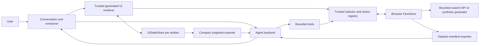

# Browser-local generative travel UI decision

> **Status:** focused decision for the generative travel demo. This document supersedes the architecture priority and scoring rubric in [`interactive-travel-ui-evaluation.md`](interactive-travel-ui-evaluation.md). The earlier report remains the source inventory and detailed framework survey; its server-owned `TravelPlan` and production quote model are not requirements for this demo.

The implementation handoff for two comparable versions is [`generative-ui-ab-implementation-plan.md`](../plans/generative-ui-ab-implementation-plan.md). It defines Version A with assistant-ui `present`, Version B with an OpenUI reactive program, their shared browser data engine, tests, worktree ownership, and incremental PR gates.

## Decision to make

Choose the framework and renderer for a conversational travel demo whose strongest quality is the experience: polished visual design, usable controls, adaptive arrangements, and fast direct manipulation. The assistant should stream prose and generated interface blocks into one conversation. It may choose different arrangements from a trusted component catalog, or a comparably safe constrained representation, rather than always returning one fixed itinerary workspace.

The browser owns the fare rows and interactive artifact state. A normal search downloads a bounded fare dataset. Date, mode, carrier, duration, price, sort, selection, and total changes over that covered dataset update locally without a model call. The agent sees a dataset manifest, a compact state snapshot, conversation history, and bounded tool results. It never receives the full fare dataset.

Synthetic data is acceptable. Booking, live inventory, production pricing, and a server-authoritative plan ledger are outside this decision. The design must preserve a path to real search APIs without making production concerns the main selection criterion.

No framework or runtime change is implemented in this phase.

## Experience and acceptance scenarios

The demo decision is successful only if the proposed stack can support these scenarios:

1. A user asks for the cheapest or fastest way from one city to another. The assistant streams a short explanation and an attractive interactive arrangement containing dates, duration, transport modes, filters, offers, and totals.
2. A user asks for at least three cities with different transport modes and stay durations. The assistant may choose a timeline, comparison grid, map-adjacent layout, compact cards, or another composition from the catalog. The result remains coherent on desktop and mobile.
3. The user directly changes a date, duration, mode, carrier, filter, sort, or selected fare. Covered rows are filtered and totals are recomputed immediately in the browser. This direct manipulation does not start a model turn.
4. A direct edit outside the cached coverage starts a bounded data load. The interface reports loading or partial coverage, ignores stale responses, and keeps the assistant out of the local interaction loop.
5. The next text message includes the latest compact UI state and the last-interacted artifact. The assistant can rearrange that artifact, create another interactive artifact over the same dataset references, or answer with text only.
6. Several artifacts may coexist. Each has versioned UI state, or explicitly shares a small semantic state object. Interacting with an older artifact never silently rewrites another artifact.
7. Text and UI stream without mounting an invalid partial tree. Unknown components, invalid bindings, and unavailable data references produce a useful fallback.
8. Large fare arrays never enter the model prompt, tool transcript, generated component props, exported UI state, logs intended as model context, or conversation persistence.
9. The conversation has a usable composer and history. Reload can restore messages, artifact specifications, dataset references and coverage, compact UI state, and selected IDs; fare rows may be reloaded from their resource descriptor.
10. The design works with the current React and Vite application. TypeScript may be introduced at new model, catalog, tool, and store boundaries without requiring a Next.js rewrite or an up-front migration of all JSX.

### Demo moments the catalog must support

- **“Show the cheapest options next week.”** Compose a price calendar, mode facets, and offer cards over a bounded week dataset.
- **“Compare train and bus visually.”** Replace the arrangement with side-by-side summaries and a duration-versus-price chart, while preserving the selected IDs and filters.
- **“Plan three cities with different stays.”** Compose a route or map, timeline, stay-allocation control, per-leg mode controls, offer choices, and a locally derived total.
- **“Show the same options as a timeline.”** On the next turn, rearrange the existing dataset references and current UI state. Do not redownload rows or place them in the prompt. A question that needs no visual should receive text only.

The catalog should expose small layout primitives and data-bound travel widgets rather than forcing every answer through a fixed `TravelWorkspace`. High-quality host CSS, variants, responsive behavior, and animation determine the polish; model composition determines which visual story fits the request.

## Current application and data boundary

The repository is a conventional search demo, not yet a conversational or generative UI application.

[`App.jsx`](../../src/App.jsx#L23) loads `/api/locations` and `/api/metadata` on startup. It keeps the active search and one result payload in React state. [`runSearch`](../../src/App.jsx#L73) cancels the previous request, fetches one `/api/search` response, and replaces the previous rows. There is no browser persistence, multi-query cache, dataset identity, coverage marker, artifact state, chat history, model stream, or agent tool loop.

The search contract is paginated. [`parse_search_query`](../../backend/app.py#L89) accepts pages with 1 to 100 rows, defaulting to 20. [`_search_leg`](../../backend/app.py#L294) applies SQL `LIMIT` and `OFFSET`, reports the matching count and page count, and returns one page. [`buildSearchUrl`](../../src/api.js#L186) sends one origin, destination, departure date, optional reversed return date, passenger count, mode, sort, page, and limit.

The checked-in generated database was measured locally for this decision:

| Resource | Current measured size |
|---|---:|
| SQLite database | 154 MiB |
| Fare rows | 1,000,000 |
| Routes | 442 |
| Locations | 144 |
| Companies | 63 |
| `/api/locations` compact JSON | 61,860 bytes, including 368 destination links |
| `/api/metadata` compact JSON | 93,549 bytes |
| London to Paris on 2026-10-02 | 8 rows, 4,207-byte search response at limit 100 |

Across the current database, an origin-destination-date group has 3 rows at the minimum and median, 9 rows at the 95th and 99th percentiles, and 12 rows at the maximum. The default 20-row page therefore happens to contain every row for every generated one-way query in this database. That is a property of the current seed, not a completeness guarantee in the API contract.

The browser can safely retain the current location and route metadata plus complete, bounded search snapshots. It should not download the 154 MiB database. A future dataset resource must declare its coverage explicitly. The loader can satisfy that contract by requesting a purpose-built complete scenario, exhausting pages within a bounded query, or generating a complete synthetic window in the browser. It must not infer completeness from today's maximum of 12.

[`ResultsPage`](../../src/components/ResultsPage.jsx#L194) already filters the loaded rows by one mode, applies a direct-only predicate, sorts locally, and stores a selected ID. Date, mode, and sort handlers still fetch from the server. The direct-only filter currently has no meaningful effect because [`normalizeTrip`](../../src/api.js#L50) defaults missing transfers to zero and the backend does not return segments or transfers. The current response supports one outbound origin-destination leg and an optional reverse return; multi-city and per-leg mixed modes require several bounded datasets or a new scenario resource.

## Ownership and data flow

The core unit is an artifact backed by opaque dataset references and a compact UI state. Fare rows stay in the browser.

### Browser `FareStore`

Each resource has a stable `datasetId`, revision, schema version, coverage descriptor, row count, compact summary, loading state, and source descriptor. Rows are indexed by opaque fare ID and never embedded in a generated scene. Coverage includes the origins, destinations, dates or date window, passengers, included modes, and whether the resource is complete for that scope.

The store may hold several query resources for a multi-city artifact. A new visual arrangement reuses their IDs. It does not redownload or copy the rows into a message. Requests outside coverage create or extend a resource and use request IDs or revisions so a late response cannot replace newer data.

### Per-artifact `UIStateStore`

Each interactive artifact has an `artifactId`, specification revision, data revisions, filters, dates, stay allocation, allowed modes, sort, selected fare IDs, pending state, last interaction time, and a small derived summary. The conversation tracks the last-interacted artifact explicitly.

Two artifacts can point to the same fare datasets while keeping separate presentation state. Deliberate cross-artifact behavior uses a named shared semantic state object. Merely showing the same city or fare does not imply shared mutation.

The user may keep editing while an agent response streams. Sending a message captures a `uiStateRevision`, while generated layouts bind to the current host state when they mount. Generated defaults initialize only missing keys; they do not overwrite newer clicks with values captured at send time. An agent-proposed semantic state change carries its expected revision. The host applies it only to a compatible revision or presents a visible reconciliation choice.

### Trusted selectors, bindings, and actions

Generated nodes bind to registered selectors such as `filteredFares`, `minimumFare`, `fastestFare`, `modeCounts`, `selectedItinerary`, and `itineraryTotal`. The host evaluates them over FareStore rows and UI state. Generated content can select and arrange capabilities; it cannot provide executable JavaScript or claim arbitrary fare values.

Direct component actions update UI state first, then recompute selectors synchronously. A change outside dataset coverage schedules a data request. It does not call the model. Price totals in this synthetic demo are derived from selected fare rows using an explicit demo rule; the UI labels that rule rather than presenting it as a bookable quote.

## Agent context and tool contracts

At the start of a turn, the backend receives normal conversation history plus a bounded current-context envelope:

- the active or last-interacted `artifactId`;
- artifact specification and dataset revision IDs;
- filters, dates, stay allocation, mode choices, sort, and selected fare IDs;
- pending, partial, complete, failed, or stale coverage status;
- small counts, extrema, and selected-itinerary totals;
- a semantic layout description or a compact generated tree when needed for rearrangement;
- dataset manifests containing schema and coverage, never rows.

The exporter uses a whitelist and a context budget. Older or large trees become short semantic summaries, while the current artifact retains enough semantic layout state to be rearranged. The snapshot is captured atomically so one prompt cannot mix UI state from one revision with summaries from another. The transport adds this envelope to the request; the agent endpoint validates its schema, size, artifact and dataset revisions, then explicitly places the accepted fields in model context and makes their references available to tools. Request metadata alone does not make the state model-visible.

The agent uses narrow tools:

| Tool | Bounded behavior |
|---|---|
| `load_fares(queryOrWindow)` | The browser fetches or generates a scoped dataset and returns only its manifest: ID, revision, coverage, row count, schema, status, and compact summary. |
| `summarize_fares(datasetId, filters, groupBy, metrics)` | Runs trusted selectors locally and returns a capped number of aggregate groups. |
| `get_top_fares(datasetId, filters, objective, limit)` | Returns at most five IDs and the small set of facts needed to explain a choice. |
| `get_fare(fareId)` | Returns one compact fare record. |
| `get_route(cityIdsOrRouteId)` | Returns compact route and available-mode facts. |
| `find_carriers(route, modes)` | Returns a bounded carrier list. |
| `present(scene)` or `render_scene(scene)` | Streams a schema-checked component tree containing dataset references, bindings, and registered actions. |

When a model-requested tool needs browser rows, the client executes it and returns the bounded result to the server-side model loop. Raw arrays are prohibited in component props, tool messages, debug context sent to the model, and exported UI state. Tool response size and result counts are enforced per call, and a per-turn budget prevents repeated small calls from walking the entire dataset into history.

## Evaluation rubric

Scores are informed design judgments, not performance benchmarks. Each category is scored from 0 to 5 and converted to a weighted score out of 100.

| Code | Criterion | Weight | What earns a high score |
|---|---|---:|---|
| G | Adaptive composition and style | 30% | The model can compose granular trusted components into distinct, polished responsive arrangements; the host has strong styling control. |
| B | Browser-local bindings and reactivity | 25% | Generated nodes can bind to host data and state, and direct edits recompute derived views locally without a model call. |
| M | Interleaved text and UI streaming | 20% | One response can stream prose and valid incremental UI with loading, error, and cancellation behavior. |
| S | Compact next-turn state and selective context | 15% | The host can export current UI intent and layout compactly, while tools expose only bounded fare facts. |
| E | Demo velocity and flexibility | 10% | The stack fits React/Vite, permits custom visual work, and avoids a framework migration that does not improve the demo. |

## Thirteen-repository comparison

The decision rank asks which candidate should lead this implementation. It is not a pure sort of the weighted score because several entries are renderers, transports, guides, or research artifacts rather than substitutable application platforms. The top three scores are within three points, well inside the uncertainty of this qualitative rubric. assistant-ui wins the tie-break on ordered message parts, native React authoring, and the smallest complete integration for this repository.

| Rank | Candidate and role | G | B | M | S | E | Fit / 100 | Focused judgment and application work |
|---:|---|---:|---:|---:|---:|---:|---:|---|
| 1 | [`assistant-ui/assistant-ui`](https://github.com/assistant-ui/assistant-ui): React chat runtime and generated catalog tree | 5 | 4 | 5 | 4 | 4 | **90** | Best default. `present` composes custom React recursively and ordered parts support text and UI blocks. Add the host FareStore selector adapter and request-time snapshot; interaction logs are not automatic model context. |
| 2 | [`thesysdev/openui`](https://github.com/thesysdev/openui): reactive UI language, renderer, tools, and chat | 5 | 5 | 4 | 4 | 4 | **91** | Best reactive-language alternative. Variables, browser queries, filters, aggregates, and edit mode are unusually direct. Verify renderer-local query confidentiality and accept one accumulated program/root rather than assuming arbitrary independent block placement. |
| 3 | [`vercel-labs/json-render`](https://github.com/vercel-labs/json-render): generated reactive component-tree renderer | 5 | 5 | 4 | 4 | 3 | **89** | Best substitute renderer. Conditions, repeats, computed values, watchers, store adapters, and devtools fit browser data. It still needs a chat shell and artifact persistence; use it as the only tree engine and pin the fast-moving pre-1.0 dependency. |
| 4 | [`CopilotKit/CopilotKit`](https://github.com/CopilotKit/CopilotKit): agent runtime and Dynamic A2UI BYOC | 5 | 4 | 4 | 5 | 2 | **85** | Strongest shared-context platform. Dynamic Schema A2UI adds AG-UI/A2UI middleware and a secondary UI model, and waits for the complete component array before progressive data items. Controlled frontend tools avoid that overhead but do not provide the same free nested composition. Both paths still need the FareStore adapter. |
| 5 | [`tambo-ai/tambo`](https://github.com/tambo-ai/tambo): generative components and persistent state | 3 | 4 | 4 | 5 | 5 | **79** | Fast polished component demo. Context helpers and component state support later turns, but the primary generated unit is one registered component instance. Use opaque data refs; putting fare rows in component state would violate the context boundary. |
| 6 | [`vercel/ai`](https://github.com/vercel/ai): typed message, tool, and streaming substrate | 3 | 4 | 5 | 4 | 4 | **78** | Excellent complement and transport. Ordered `UIMessage` parts, client tools, data parts, and request transforms fit the design. Alone it requires the team to invent the catalog schema, renderer, action registry, conversation product, and artifact lifecycle. |
| 7 | [`ant-design/x`](https://github.com/ant-design/x): conversation design system and dynamic cards | 3 | 3 | 4 | 3 | 3 | **64** | Polished shell, sender, bubbles, conversations, and streaming utilities. The newer A2UI-based `x-card` path needs version-specific proof for custom catalogs and state export, and adopting it also adopts Ant Design's visual system. |
| 8 | [`a2ui-project/a2ui`](https://github.com/a2ui-project/a2ui): cross-client declarative surface protocol | 4 | 3 | 2 | 4 | 2 | **63** | Trusted catalogs, data bindings, dynamic lists, and client functions are useful. It supplies neither the conversation shell nor general local selector graph; JSON Pointer bindings address its data model, so external FareStore hooks remain custom work. |
| 9 | [`Chainlit/chainlit`](https://github.com/Chainlit/chainlit): Python conversation framework | 2 | 2 | 3 | 2 | 3 | **46** | Good Python-first messages and custom elements. Its fixed JSX element model lacks a documented recursive catalog and shared browser-data bridge; gaining those would require a large custom element or replacing much of the frontend advantage. |
| 10 | [`langchain-ai/agent-chat-ui`](https://github.com/langchain-ai/agent-chat-ui): LangGraph chat and artifact shell | 2 | 2 | 3 | 2 | 2 | **44** | Useful when LangGraph is already mandatory. Its artifact pane is developer-authored and it has no generated catalog, browser selector system, or compact UI-state bridge. It would add a Next.js/LangGraph migration plus a separate renderer. |
| 11 | [`ag-ui-protocol/ag-ui`](https://github.com/ag-ui-protocol/ag-ui): agent/frontend event transport | 1 | 2 | 3 | 5 | 2 | **47** | Strong transport complement for ordered events, tool calls, activities, snapshots, and deltas. It renders no UI and defines no selector or style system, so a higher numeric context score does not make it a better primary choice than an application shell. |
| 12 | [`CopilotKit/generative-ui`](https://github.com/CopilotKit/generative-ui): architecture guide and examples | 2 | 1 | 1 | 1 | 2 | **28** | Useful taxonomy for controlled, declarative, and open generation. The repository says its material is consolidated into CopilotKit; it is not an installable runtime and receives no credit for packages it references. |
| 13 | [Google Generative UI research](https://generativeui.github.io/): whole-page generation research | — | — | — | — | — | **N/A** | Valuable evidence for the visual ceiling of generated HTML, CSS, and JavaScript. It is a static research site, not a reusable React runtime, chat shell, trusted data bridge, or state contract, so scoring it as an SDK would mislead the decision. |

## Stack decision

Choose **assistant-ui with its native `present` renderer**, a granular custom React travel catalog, a browser-owned `FareStore` and per-artifact `UIStateStore`, and an AI SDK or custom transport that adds the compact current-state envelope to each model request.

This choice follows the revised product priority rather than the older server-plan architecture:

1. assistant-ui supplies the conversation, ordered message parts, bottom composer, streaming lifecycle, cancellation, retry, and tool presentation needed for a convincing chat experience.
2. Native [`present`](https://www.assistant-ui.com/docs/tools/generative-ui) emits one recursive, schema-constrained custom-component tree per call. One visible assistant turn can alternate text and several `present` blocks through repeated frontend-tool steps: `sendAutomaticallyWhen: lastAssistantMessageIsCompleteWithToolCalls` sends the browser result, and server `stopWhen` permits the next model step. [Part grouping](https://www.assistant-ui.com/docs/guides/part-grouping) preserves the ordered text and tool leaves. A call's single root can contain any number of nested rows, stacks, controls, and travel views.
3. Custom components that opt into [`streamProperties: true`](https://www.assistant-ui.com/docs/tools/generative-ui) receive partial props and streaming status; default components wait for complete props. The catalog must define skeleton and incomplete states so partial output never mounts broken controls.
4. Custom React components keep styling and responsive behavior in application code. The model chooses components, hierarchy, bindings, and presentation variants. It does not generate arbitrary CSS, fare arrays, calculations, or executable event handlers.
5. The [`ActionRegistry`](https://www.assistant-ui.com/docs/api-reference/generative-ui/actions) resolves generated action references to stable host callbacks. Those callbacks update browser UI state and trusted selectors directly, so covered filters and totals remain local. [Interaction logs are never sent to the model](https://www.assistant-ui.com/docs/tools/tool-ui); they are not the state bridge.
6. The app-owned request snapshot is the state bridge. assistant-ui's [`useChatRuntime`](https://www.assistant-ui.com/docs/api-reference/integrations/ai-sdk) accepts a custom AI SDK `ChatTransport`, and AI SDK [`prepareSendMessagesRequest`](https://ai-sdk.dev/docs/ai-sdk-ui/transport) can add the latest atomic compact snapshot and dataset manifests before each run. Experimental assistant-ui Interactables are unnecessary for the baseline; host stores make data ownership and context limits explicit.

Do not add json-render, OpenUI, A2UI, or another scene engine to the baseline. Two scene schemas, registries, binding systems, action lifecycles, and streaming error models would slow the demo and make the browser-state boundary harder to audit. Reconsider the renderer only after a vertical slice proves that native `present` cannot express a required arrangement or binding.

## Alternatives and tradeoffs

### OpenUI reactive program

OpenUI is the strongest integrated alternative when the demo itself should showcase an agent-authored reactive program. Its variables, client queries and mutations, field-state export and hydration hooks (`onStateUpdate` and `initialState`), and edit mode map naturally to browser selectors. Its inline response mode is described as one accumulated program with one root, so it is less clearly suited to several independently positioned generated blocks within one assistant message. Persistence remains application-owned. The host still needs an explicit snapshot whitelist and tool-output caps; current documentation does not establish that query results are excluded from every serialization, prompt, or history adapter.

### assistant-ui shell with json-render

Choose json-render *instead of* native `present` if the proof requires its computed values, conditions, repeats, watchers, external-store adapters, or devtools. Keep assistant-ui for the conversation shell and render json-render through one Tool UI integration. This is a capable browser-binding design, but it asks the team to integrate and own a separate pre-1.0 scene engine. Do not run both tree renderers for the same artifacts.

### CopilotKit with Dynamic A2UI

CopilotKit is attractive when a shared page-aware agent runtime and AG-UI ecosystem matter more than the smallest demo stack. `useAgentContext` and frontend tools provide strong selective context and browser actions. Its Dynamic A2UI path adds schema and data generation, catalog serialization, AG-UI arguments, and A2UI middleware; current documentation describes waiting for a complete components array before the first surface. It also needs an application adapter for opaque browser datasets and selectors. Those layers do not buy enough visual or local-data capability for this focused demo.

### AI SDK plus json-render

The Vercel AI SDK offers a direct low-level path for text, tool parts, multi-step execution, and custom transport. Pairing it with json-render provides a powerful generated tree and browser bindings. The team would also own the full conversation shell, artifact lifecycle, retry and branch behavior, persistence, and accessibility details. It is a good escape hatch if assistant-ui imposes a concrete shell limitation.

### Tambo composite or interactable components

Tambo can produce a fast conversational-component demo and its interactables are built around later agent updates. Its documented generative unit is a selected registered component instance; the docs do not show a recursive granular catalog tree. A composite travel component remains viable, but this product specifically values granular, adaptive arrangements, and the host-owned FareStore still needs an explicit adapter. Tambo is a reasonable fallback when its hosted thread and component-state model are desired as a package.

## Component catalog versus generated HTML or React

A granular catalog can reach the desired visual range when it includes expressive layout primitives, semantic travel controls, maps, charts, timelines, comparison containers, motion-ready transitions, and theme or scene variants. The model controls hierarchy, density, grouping, emphasis, and visual form. Application React controls brand quality, responsive breakpoints, animation, accessibility, data subscriptions, and failure states.

Generated HTML, CSS, or React has a higher visual ceiling for a one-off destination story, simulation, or unusual explainer. It also needs a sandbox or compiler, dependency and content-security policy, a narrow parent-window RPC bridge, lifecycle cleanup, error recovery, accessibility checks, and a way to recover compact semantic state for the next turn. Passing rows into generated source or props would break the data boundary. Giving sandboxed code direct access to the parent store would make that boundary hard to audit.

Keep generated code outside the baseline planner. If the catalog later feels visually repetitive, add one optional sandboxed `GeneratedScene` component with a narrow bridge such as `query(datasetRef, selectorRef, compactArgs)`, `dispatch(actionRef, statePath, payload)`, and `subscribe(statePath, selectorRef)`. That experiment should earn its place by producing a materially better experience than three different catalog compositions while retaining the same row-confidentiality and snapshot rules.

## Proposed evidence plan, without implementation

The next phase should prove the decision with a narrow, disposable vertical slice before migrating the application:

1. Define one compact dataset manifest, one per-artifact UI snapshot, and one scene schema using opaque dataset and fare IDs.
2. Load one complete synthetic city-pair/date dataset into a browser store and prove local mode, carrier, price, duration, sort, selection, and total changes without network or model requests.
3. Stream prose and one scene containing at least six granular catalog components in two materially different arrangements. Verify partial-tree, invalid-node, and cancellation behavior.
4. Export the snapshot, start a follow-up turn, and prove the model can rearrange the active artifact while reusing its dataset reference. Inspect the model request and confirm it contains no fare array.
5. Render the same scene at narrow phone, tablet, and desktop widths and complete keyboard-only date, filter, option-selection, and composer flows.
6. Measure first response latency, local interaction latency, model-context bytes, snapshot bytes, and generated-tree size. Set explicit caps before broadening the catalog.

These are proposed verification gates. No prototype was built or run as part of this decision.

## Requirement coverage audit

| Explicit requirement | Decision coverage |
|---|---|
| Wow-level styling, usability, and adaptive interactive UI | Experience scenarios; G rubric; trusted granular catalog and evidence plan |
| Browser downloads fares like a normal search | Current data boundary; FareStore coverage contract |
| Agent never receives the full dataset | Ownership diagram; snapshot whitelist; bounded tool rules |
| Agent generates arrangements from a custom catalog or constrained representation | Trusted selectors and renderer; G rubric; stack decision |
| Text and UI interleave and stream | Scenario 1 and 7; M rubric; stack decision |
| Local transforms and totals react immediately | Scenario 3; trusted selectors and actions |
| Selective `get_fare`, `get_route`, and `find_carriers` tools | Agent tool contract table |
| Next turn receives latest compact UI state and history | Agent context envelope and atomic snapshot |
| Agent can rearrange, create a new artifact, or answer with text | Scenario 5; per-artifact state policy |
| Multiple artifacts do not silently mutate one another | Scenario 6; UIStateStore ownership |
| User edits made while an agent response streams are preserved | UI-state revision, current-state binding, and compatible revision rule |
| Synthetic fares are acceptable | Decision scope; bounded loader and evidence plan |
| Current application and browser data availability are verified | Measured repository baseline and source links |
| JavaScript or incremental TypeScript without mandatory rewrite | Scenario 10; E rubric |
| Evaluate and decide among all 13 prior repositories | Thirteen-repository table; final stack decision |
| Research and decision only | Scope statement; evidence plan explicitly excludes implementation |
