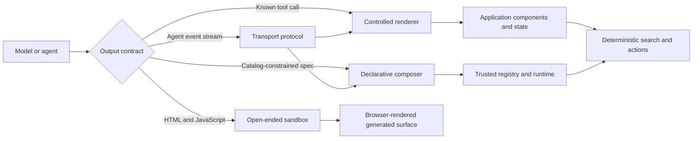

# Generative UI repositories and patterns for the Omio demo

Checked 2026-10-02.

## Scope and method

This report compares thirteen public repositories that approach generative UI from different directions. Some map tool calls to components, some let a model compose a constrained component tree, some provide an agent transport, and some are complete chat applications. Two entries need special labels: the Google Research repository is an academic website and evaluation resource, and `CopilotKit/generative-ui` is an educational pattern index whose runnable work moved into the main CopilotKit repository.

The research used project repositories, official documentation, source trees, release pages, and license files. The projects were not installed, benchmarked, or load-tested in this application. Status descriptions are therefore narrow, dated observations, not claims that a project is production-ready. Recommendations for Omio are design inferences based on the sources and the local code.

The current application is a React 19.2 and Vite 7.3 client with no agent runtime, AI SDK, schema library, UI kit, router, or external state library. [`App`](../../src/App.jsx#L23) owns local state and abortable requests. [`SearchForm`](../../src/components/SearchForm.jsx#L5) contains the accessible location chooser and travel controls. [`ResultsPage`](../../src/components/ResultsPage.jsx#L158) owns mode, date, leg, sort, direct-only, selection, and pagination interactions. A small [API adapter](../../src/api.js#L21) normalizes responses from a dependency-free Python HTTP service backed by SQLite. The one million fares are deterministic synthetic data, as the [project README](../../README.md#L1-L6) and [backend contract](../../backend/README.md#L1-L12) state. There is no live inventory, purchase, or booking transaction in the demo.

## Conclusions

For conversational search that renders the existing result UI, controlled tool rendering is the smallest coherent step. The model chooses a known action such as `search_fares`, `change_sort`, or `show_trip_details`; application code executes it and renders the current components. [Vercel AI SDK](#4-vercel-ai) is the leanest conceptual option. [CopilotKit](#2-copilotkitcopilotkit) adds shared agent state, frontend tools, and human approval when the assistant needs tighter coordination with the page.

For actual model-composed layouts, [json-render](#10-vercel-labsjson-render) fits the current React application best. A narrow catalog could expose the existing travel components while keeping fare search and any future transaction authority in deterministic code. [OpenUI](#13-thesysdevopenui) is a larger but richer runtime for generated forms, reactive state, queries, and mutations. [Tambo](#5-tambo-aitambo) is compelling when the agent should update persistent components already mounted on the page.

[A2UI](#8-a2ui-projecta2ui) is the strongest option when remote agents or several client platforms must exchange a safe declarative UI. [AG-UI](#9-ag-ui-protocolag-ui) can carry streamed events and state around that UI, but it does not render anything by itself. assistant-ui, Ant Design X, Chainlit, and LangChain Agent Chat UI provide substantial assistant shells and interaction systems. They should be evaluated as product-shell choices, not treated as interchangeable component-composition engines.

## Comparison matrix

| Repository | Category | Generation mechanism | Concrete reusable material | Status and license | Omio fit |
| --- | --- | --- | --- | --- | --- |
| [CopilotKit/generative-ui](https://github.com/CopilotKit/generative-ui) | Educational pattern index | Explains controlled, declarative, and open-ended UI | Taxonomy, hook patterns, security tradeoffs, links to current examples | Public guide, consolidated into the main monorepo; standalone license not verified | Use its controlled-UI model; do not install it as an SDK |
| [CopilotKit/CopilotKit](https://github.com/CopilotKit/CopilotKit) | Agent framework and React UI | Tools, synchronized agent state, approval UI, A2UI and MCP Apps | React hooks, provider, sidebar/chat, generative playground, middleware | Active project; root MIT, with a separate source-available boundary under `showcase/` | Good for a page-aware travel assistant with shared state and approvals |
| [assistant-ui/assistant-ui](https://github.com/assistant-ui/assistant-ui) | Assistant shell and runtimes | Tool UI, `present` component trees, named generative parts, LangGraph data UI | Thread/message/composer primitives, 29-component vocabulary, runtime adapters | Active project, MIT | Good if chat becomes a primary surface; Tool UI can preserve existing state |
| [vercel/ai](https://github.com/vercel/ai) | Model and streaming SDK | Typed tool parts mapped by application code to React components | Stream lifecycle, provider abstraction, tool handling, AI Elements registry | Active project, Apache-2.0 | Smallest controlled-rendering step; no automatic travel renderer |
| [tambo-ai/tambo](https://github.com/tambo-ai/tambo) | Full-stack generative interface runtime | Registered generative components plus agent-updated interactables | React provider/hooks, persistent component state, forms, map, MCP elicitation | Public project; root MIT, with `apps/api` under Apache-2.0 | Strong for agent-managed filters and selected trip; meaningful backend commitment |
| [langchain-ai/agent-chat-ui](https://github.com/langchain-ai/agent-chat-ui) | Complete LangGraph chat application | LangGraph streams messages and developer-authored artifact UI | Next.js app, inbox/history/messages, artifact panel, multimodal previews | Continuously updated app, MIT, no versioned releases | Reference unless Omio intentionally moves to LangGraph and Next.js |
| [Chainlit/chainlit](https://github.com/Chainlit/chainlit) | Python conversational app framework | Python sends messages, elements, actions, or named custom JSX | Built-in media/data elements, input widgets, CustomElement, React client, copilot | Community-maintained, Apache-2.0 | Useful Python sidecar; current components need adaptation across its runtime boundary |
| [GenerativeUI/GenerativeUI.github.io](https://github.com/GenerativeUI/GenerativeUI.github.io) | Academic site and evaluation resource | Model emits a complete HTML/JavaScript page and assets | Paper, PAGEN browser, prompts and evaluation examples | Website content declares CC BY-SA 4.0; no reusable SDK or software license published | Inspiration for rich destination pages, not the authoritative fare path |
| [a2ui-project/a2ui](https://github.com/a2ui-project/a2ui) | Declarative UI protocol and renderers | Remote agent streams catalog-constrained JSON surfaces and data updates | Protocol, basic 18-component catalog, web/mobile renderers, examples | Early public preview; v0.9.1 described as stable; Apache-2.0 | Best for remote-agent and multi-platform interoperability |
| [ag-ui-protocol/ag-ui](https://github.com/ag-ui-protocol/ag-ui) | Agent-to-frontend event protocol | Bidirectional events for messages, tools, state, activities, and custom UI payloads | Core/client protocol, connectors, events, examples | Published 1.0 line, MIT | Optional transport for a real streaming agent; requires a separate renderer |
| [vercel-labs/json-render](https://github.com/vercel-labs/json-render) | Constrained component-tree runtime | Model streams a JSON spec from an application-owned catalog | Core and React runtimes, registry, state/actions, devtools, many render targets | Active Vercel Labs pre-1.0 project, Apache-2.0 | Best incremental model-composed layout option |
| [ant-design/x](https://github.com/ant-design/x) | AI-focused design system and chat SDK | Chat/tool streams, with an emerging structured card path | Chat components, requests/providers, Markdown, files, reasoning UI, `x-card` | Active 2.x project, MIT; requires Ant Design 6 | Coherent if Ant Design becomes the UI foundation; high churn otherwise |
| [thesysdev/openui](https://github.com/thesysdev/openui) | Generative UI language and runtime | Model streams OpenUI Lang into a trusted component library | React and other runtimes, state/forms/query/mutation semantics, adapters, devtools | Active collection of mostly pre-1.0 packages, MIT | Rich generated travel workflows; heavier language/runtime adoption than json-render |

## Architecture taxonomy

The useful dividing line is who chooses the layout and which part of the system owns state and side effects.

Controlled rendering includes Vercel AI SDK tool parts, CopilotKit frontend tools, assistant-ui Tool UI, and Chainlit custom elements. A model or application agent loop selects a known function or component, while the developer defines its implementation and visual behavior. In Chainlit, application code sends the named element. This offers the best preservation of accessibility, styling, and existing state ownership.

Declarative composition includes json-render, OpenUI, A2UI, assistant-ui `present`, and Ant Design X's developing structured-card path. The model produces a tree or flat graph using an allowlisted vocabulary. The client validates it and maps names to trusted components. This creates real layout variation without executing arbitrary generated code.

Agent transport is a separate concern. AG-UI streams messages, tool calls, state deltas, and activity events. A2UI or another UI description can travel through it. A transport should not be credited with forms, cards, or rendering that belong to the payload format and client runtime.

Open-ended generation creates whole HTML and JavaScript surfaces. The Google Research system renders its generated page as-is in the user's browser. CopilotKit also documents optional iframe-oriented patterns. Isolation is an application design choice, not a property established by the Google paper. This category offers the widest design space and the weakest control over branding, accessibility, latency, security, and deterministic behavior. It suits optional explainers and visualizations better than fare selection or confirmation.

## Repository details

### 1. CopilotKit/generative-ui

The [standalone guide](https://github.com/CopilotKit/generative-ui/blob/main/README.md) is the requested starting point. It defines three patterns clearly. Controlled UI invokes a developer-authored component or tool with typed data. Declarative UI sends a structured description such as A2UI. Open-ended UI supplies a complete sandboxed surface, commonly through MCP Apps or HTML and JavaScript.

The repository is an educational index, not the current package source. Its README says the work was consolidated into the main CopilotKit monorepo, and it has no GitHub Releases. No license file was verified in this standalone repository, so the main monorepo's license should not be silently applied to it. The linked [OpenGenerativeUI guide](https://github.com/CopilotKit/OpenGenerativeUI/blob/main/docs/generative-ui.md) documents `useComponent`, frontend/render tools, default render tools, and human-in-the-loop hooks, plus an iframe path for streamed HTML, SVG, or Canvas.

For Omio, the durable lesson is the controlled pattern. The assistant can select the existing search, result, trip-detail, and review components. The current accessible input and result behavior stays in application code. Free-form iframe content can remain an optional destination explainer, where a rendering failure does not corrupt the search flow.

### 2. CopilotKit/CopilotKit

The [main repository](https://github.com/CopilotKit/CopilotKit) is the active framework. It combines chat UI, frontend and backend tools, application-agent shared state, human approval, persistent threads, declarative A2UI, and MCP Apps. The [generative UI playground](https://github.com/CopilotKit/CopilotKit/tree/main/examples/showcases/generative-ui-playground) includes prebuilt weather and stock cards, a task-approval card, MCP calculator/flight/hotel/trading apps, and A2UI restaurant and booking forms. Those travel examples show interaction shapes, not live inventory or transaction support.

The controlled path registers known tools and renderers through hooks such as `useFrontendTool`. Synchronized coagent state can drive a UI, and `renderAndWait` style flows can stop for a person's response. This makes it suitable for a travel assistant that updates route, date, passenger, filter, and selected-trip state while preserving deterministic API calls.

Adoption adds a provider, an agent runtime/protocol, schemas, and streaming. The playground's Next.js frontend, TypeScript MCP server, and Python A2A agent are reference architecture, not a unit that should be copied into this Vite app. The root is [MIT licensed](https://github.com/CopilotKit/CopilotKit/blob/main/LICENSE), while the `showcase/` subtree has a separate [source-available license](https://github.com/CopilotKit/CopilotKit/blob/main/showcase/LICENSE). The cited playground is under `examples/showcases/generative-ui-playground`; no nearer license was found, so the root MIT license appears to govern it. Copied material still needs path-level license review.

### 3. assistant-ui/assistant-ui

[assistant-ui](https://github.com/assistant-ui/assistant-ui) is a React assistant shell with pluggable runtimes. It has four relevant mechanisms. [Tool UI](https://www.assistant-ui.com/docs/tools/tool-ui) binds a known tool to a developer renderer and can render streaming arguments. The [`present` path](https://www.assistant-ui.com/docs/tools/generative-ui) lets a model create a tree from a shipped or custom vocabulary. The [generative UI primitive](https://www.assistant-ui.com/docs/tools/generative-ui-primitive) resolves named backend parts through an allowlist. LangGraph data UI renders named UI events from a graph stream.

Its core primitives cover threads, messages, composer, thread lists, actions, retries, attachments, Markdown, code, voice, approvals, keyboard behavior, and accessibility. The [default vocabulary](https://www.assistant-ui.com/elements/vocabulary) contains 29 layout, text, data, media, control, list, and feedback components, including cards, tables, charts, forms, and carousels. It does not contain station search, passenger controls, itinerary legs, fare cards, or booking summaries, so Omio would still need a custom vocabulary.

`ExternalStoreRuntime` is the attractive seam for the current application because Omio can retain state ownership and callbacks. Tool UI can render fare search and trip details without adopting model-composed layouts. The full assistant shell makes sense only if chat becomes a central product surface. The project is [MIT licensed](https://github.com/assistant-ui/assistant-ui/blob/main/LICENSE).

### 4. vercel/ai

The [Vercel AI SDK](https://github.com/vercel/ai) provides model-provider abstraction, streaming, typed tools, and frontend message state. Its [generative interface guide](https://ai-sdk.dev/docs/ai-sdk-ui/generative-user-interfaces) uses controlled rendering: a model selects a declared tool, the tool executes, and application code maps its typed message part to a React component. Current lifecycle states distinguish streamed input, available input, requested and answered approval, available output, errors, and denied output.

The SDK does not compose a component tree by itself. Each Omio capability would need a schema, execution path, and rendering branch. That explicit work is also why it is the least disruptive option. Existing components can render `search_fares`, `change_sort`, `show_trip_details`, and a future `prepare_booking` result without giving the model control of fare values or side effects.

[AI Elements](https://elements.ai-sdk.dev/) is a copy-owned [component source registry](https://github.com/vercel/ai-elements) for chat, code, voice, and workflow experiences. Representative components include Conversation, Message, Prompt Input, Tool, Confirmation, Sources, Artifact, Canvas, Node, and Edge. Its shadcn and Tailwind assumptions do not match the current bespoke CSS. The [full Chatbot template](https://vercel.com/templates/ai/chatbot) adds Next.js, server actions, authentication, storage, and other services, so it is not a small Vite integration. The repository is [Apache-2.0 licensed](https://github.com/vercel/ai/blob/main/LICENSE).

### 5. tambo-ai/tambo

[Tambo](https://github.com/tambo-ai/tambo) registers React components with names, descriptions, implementations, and Zod prop schemas. A generative component is selected and instantiated inside a conversation response. An [interactable component](https://docs.tambo.co/concepts/generative-interfaces/interactable-components) is mounted by the application and updated in place by the agent. [`useTamboComponentState`](https://docs.tambo.co/concepts/generative-interfaces/component-state) shares user edits with later turns and persists them for thread rehydration.

Interactables map neatly to the current travel page. The model could update the mounted route, dates, passengers, sort, mode, or selected trip while the React page remains visible. Generative components could add a comparison chart, map, or itinerary summary. Tambo's [component catalog](https://ui.tambo.co/) includes conversation shells, forms, a Leaflet/OpenStreetMap map, graph UI, and MCP elicitation controls. It does not supply Omio-specific fare components.

This convenience comes with a larger runtime decision. Tambo includes its own agent loop, streaming, reconnection, threads, cloud service, and self-hosting path. It requires provider and identity setup plus schemas, and its state ownership can overlap with the current `App` state unless the boundary is redesigned. The root is [MIT licensed](https://github.com/tambo-ai/tambo/blob/main/LICENSE). The repository README says some workspaces, including `apps/api`, are Apache-2.0, so file-level review is required when copying code.

### 6. langchain-ai/agent-chat-ui

[Agent Chat UI](https://github.com/langchain-ai/agent-chat-ui) is a complete Next.js client for a LangGraph server whose state contains messages. It renders conversations, tool activity, history, an inbox, Markdown and code, multimodal previews, and developer-authored artifacts in a side panel. LangGraph streams the data. The application does not provide a general model-composed component catalog.

This is reusable by forking an application rather than adding a small component package. Its current stack includes Next.js, React 19, Tailwind, Radix, motion, charts, Markdown tooling, and the LangGraph SDK. Production also needs a real authentication boundary; the repository warns that its convenience proxy can expose threads, stored data, and billable runs if deployed without one.

The archived [LangGraph generative UI examples](https://github.com/langchain-ai/langgraphjs-gen-ui-examples) contain accommodation and restaurant flows with location, dates, and guests. They are useful interaction references, but some values are static and the repository is archived. Agent Chat UI is a poor incremental fit unless Omio deliberately adopts LangGraph and Next.js. It is [MIT licensed](https://github.com/langchain-ai/agent-chat-ui/blob/main/LICENSE).

### 7. Chainlit/chainlit

[Chainlit](https://github.com/Chainlit/chainlit) is a Python-first conversational application framework. Python sends messages, nested steps, actions, built-in elements, named custom JSX elements, and input requests. It streams messages and tool progress, manages sessions and persistence, and can run as a full web app, a React client, or an embeddable copilot.

The built-in set includes text, images, dataframes, files, PDFs, audio, video, Plotly, Pyplot, and task lists. Input widgets include date, select, multi-select, radio, slider, switch, tags, and text. A [CustomElement](https://docs.chainlit.io/api-reference/elements/custom) loads a named JSX file in Chainlit's managed shadcn/Tailwind environment and can call a Python action or update its props. [`AskElementMessage`](https://docs.chainlit.io/api-reference/ask/ask-for-element) can pause for a form or approval.

That Python control plane is attractive beside the existing backend. A copilot could call host functions that set route, date, passenger, or selected-trip state. Direct reuse is less clean because the current component tree and CSS do not automatically move into Chainlit's environment. The application would gain another thread, WebSocket, authentication, styling, and persistence system.

The original team stepped back in 2025 and the project is now community-maintained. The [2026 changelog](https://github.com/Chainlit/chainlit/blob/main/CHANGELOG.md) records security fixes and a breaking MCP configuration migration, so current changelog and source guidance should override stale setup pages. Chainlit is [Apache-2.0 licensed](https://github.com/Chainlit/chainlit/blob/main/LICENSE).

### 8. a2ui-project/a2ui

[A2UI](https://github.com/a2ui-project/a2ui) is a transport-independent declarative UI protocol. A remote agent sends JSON rather than executable code. The client resolves component names only from a trusted catalog. Components form a flat adjacency list keyed by IDs, which supports incremental updates. Messages create and delete surfaces, update components, and update the data model. Bindings connect props to data, and actions return user intent to the agent.

The basic catalog has 18 components. It covers text, image, icon, video, audio, row, column, list, card, tabs, divider, modal, button, checkbox, text field, date-time input, choice picker, and slider. The repository provides React, Lit, Angular, Flutter, Lynx, and other renderer work, plus composer/theater demos and guides for A2A, AG-UI, and MCP transport. Omio would need a custom catalog for trip cards, leg timelines, fare badges, mode/date tabs, filters, pagination, and expanded details.

The README labels the project an early-stage public preview. Its [roadmap](https://github.com/a2ui-project/a2ui/blob/main/docs/public/roadmap.md) also describes v0.9.1 as the current stable protocol and several v0.9.1 renderers as stable. The precise description is that the release is stable within a project whose overall public status remains early. A2UI is most valuable if a remote travel agent must render safely across web and mobile clients. It is Apache-2.0 licensed.

### 9. ag-ui-protocol/ag-ui

[AG-UI](https://github.com/ag-ui-protocol/ag-ui) is a bidirectional agent-to-frontend event protocol. It covers run lifecycle, streamed text, tool-call arguments and results, state snapshots and deltas, activity, message snapshots, and raw or custom events. It can use server-sent events, WebSockets, webhooks, or a reference HTTP connector.

AG-UI does not supply cards, forms, tabs, or a component registry. Its [generative UI guide](https://github.com/ag-ui-protocol/ag-ui/blob/main/docs/concepts/generative-ui-specs.mdx) describes carrying A2UI, MCP Apps, Open-JSON-UI, or an application-specific format. This makes it complementary to a renderer. It can stream search progress, fare tool calls, shared filters, interruptions, and approvals while json-render, A2UI, OpenUI, or existing React code handles the view.

The repository has published a 1.0 core/client/protocol line and is [MIT licensed](https://github.com/ag-ui-protocol/ag-ui/blob/main/LICENSE). It adds needless machinery while Omio remains a local request/response demo. Revisit it if the backend becomes a long-running agent whose state and activity must stay synchronized with the browser.

### 10. vercel-labs/json-render

[json-render](https://github.com/vercel-labs/json-render) lets an application define a trusted catalog of component prop schemas, descriptions, and actions. The catalog produces model instructions. The model emits a JSON spec with a root ID and a flat element map. A registry maps those names to application components, and `SpecStream` applies partial patches for progressive rendering.

The runtime supports state references, conditions, templates, computed values, visibility, repeats, named slots, watchers, form validation, and action chains. Built-in state actions can set, append, or remove values, while application actions remain registered handlers. Devtools inspect the spec, catalog, stream, state, actions, and component selection. Render targets cover React and several other web, native, document, terminal, media, and 3D contexts. State adapters include Redux, Zustand, Jotai, and XState.

The optional [shadcn catalog](https://github.com/vercel-labs/json-render/blob/main/skills/shadcn/SKILL.md) has 36 layout, navigation, overlay, content, feedback, and input components. It assumes Tailwind and shadcn primitives that this app does not use. A custom registry over `SearchSummary`, `TripList`, `TripCard`, `LegTimeline`, `FareBadge`, tabs, sort, pagination, and expansion controls would preserve the current design.

json-render still needs schemas, a model prompt, a backend stream, and an AI provider. Its examples are TypeScript-oriented, while this application is JavaScript. It is an active Vercel Labs pre-1.0 project, so experimental status and API change are part of the adoption cost. The license is [Apache-2.0](https://github.com/vercel-labs/json-render/blob/main/LICENSE).

### 11. GenerativeUI/GenerativeUI.github.io

Google Research's [Generative UI project](https://generativeui.github.io/) studies whole-page generation. Its system combines server tools such as search and image generation, detailed Gemini instructions, and lightweight post-processing. The model outputs a complete HTML page and assets, including JavaScript behavior, and the browser renders it directly. This is open-ended code generation rather than selection from a trusted catalog.

The [paper](https://arxiv.org/abs/2604.09577) evaluates the approach on retained LMArena prompts and information-seeking prompts, with pre-cached outputs shown to raters. On the 92 retained LMArena prompts, the authors report an 82.8 percent preference over Markdown. That number describes the paper's specific prompt sample and evaluation, not universal UI quality. The [PAGEN browser](https://generativeui.github.io/static/pagen/index.html) is useful for inspecting outputs and prompt coverage.

Generation can take one or two minutes, and HTML, CSS, and JavaScript errors can occur. This is a weak foundation for an authoritative fare workflow but a useful reference for itinerary stories, interactive maps, destination explainers, and optional microsites. The [GitHub repository](https://github.com/GenerativeUI/GenerativeUI.github.io) contains the static academic website, not an SDK or implementation runtime. The website content declares CC BY-SA 4.0, and no reusable software license is published there. Publication metadata conflicts across the primary sources.[^google-date] This report relies on the described capabilities rather than inferring maturity from the date.

### 12. ant-design/x

[Ant Design X](https://github.com/ant-design/x) is an AI-focused React design system. `@ant-design/x` provides conversation components. `@ant-design/x-sdk` handles requests and chat-provider data flow. Separate packages cover streaming Markdown, structured cards, and component/API guidance.

Concrete UI includes bubbles and message lists, sender/composer, conversations, prompts, welcome screens, reasoning chains, sources, actions, attachments, file cards, suggestions, and notifications. `XRequest` handles streaming, cancellation, retry, timeouts, and response transforms. This overlaps with the current abortable request behavior, but the main value is a complete assistant experience rather than travel-specific UI.

The `x-card` structured card path exists in current releases, including A2UI-related work, but its package README and the broader documentation do not yet present one cohesive renderer workflow. It should be treated as a developing part of the system. The current 2.x line requires React 18 or newer and Ant Design 6.

This is a reasonable option if Omio intends to adopt Ant Design as the product foundation. For the present bespoke CSS, the dependency, theme, and visual migration is disproportionate to the generative feature. The repository is [MIT licensed](https://github.com/ant-design/x/blob/main/LICENSE).

### 13. thesysdev/openui

[OpenUI](https://github.com/thesysdev/openui) is a language and runtime for streamed generative interfaces. An application defines a component library with Zod schemas. The model receives generated instructions and emits compact OpenUI Lang. The runtime incrementally parses and validates statements, resolves the registered components, and executes application-owned state operations and actions.

The language supports forward references and incremental edits. Reactive variables plus set, reset, and run operations enable local interactions. [Queries and mutations](https://www.openui.com/docs/openui-lang/queries-mutations) call registered application tools, so generated UI can fetch and change data without invoking the model for every click. Forms, action events, default loading values, and renderer error hooks are built into the model.

Documented components include stacks, cards, text, forms and controls, inputs, selects, buttons, tabs, tables, and charts. Packages span React, Vue, Svelte, Angular, email, browser, AG-UI, LangChain, A2UI, server, CLI, devtools, and observability. Examples cover Material UI, shadcn, Supabase, HTML artifacts, email, and spreadsheet-like UI.

A narrow travel library could reuse the current trip cards and controls while adding generated forms and tool-backed fare queries. The cost is a custom DSL, parser/runtime, schemas, model backend, and a larger state/action design than json-render. Any future purchase mutation should remain a deterministic server action with an explicit confirmation step. The repository is [MIT licensed](https://github.com/thesysdev/openui/blob/main/LICENSE). The former Crayon repository redirects here and is not counted as a separate project.

## Practical experiment plan

No implementation is required to answer the research question. If the team decides to test the findings, use one narrow slice and keep the existing application as the control.

1. Define four read-only or reversible actions: search fares, change sort, select a trip, and show details. Keep the current Python API and normalized result model as the source of truth.
2. Expose three existing views through a small registry: search summary, trip list/card, and selected-trip details. Preserve current ARIA behavior and CSS.
3. Prototype controlled rendering first with either Vercel AI SDK or CopilotKit. Measure integration size, time to first useful UI, cancellation behavior, schema failures, and accessibility regressions.
4. Prototype model composition with json-render using the same components and actions. Compare whether layout variation adds useful decisions or merely rearranges stable travel controls.
5. Add OpenUI only if the experiment specifically needs model-authored forms, reactive queries, or post-generation mutations. Add AG-UI only if a persistent streaming agent backend becomes part of the target architecture.
6. Keep any future booking or payment call behind a developer-authored review screen and explicit human confirmation. The present demo has no such transaction, so the first experiment should stop at a prepared itinerary or selected synthetic fare.

The evaluation should distinguish renderer errors, model/schema errors, backend errors, and invalid travel-state transitions. A generated surface is successful only if it preserves the current application's keyboard access, deterministic fare data, cancellation semantics, and clear synthetic-data labeling.

## Adjacent and excluded projects

Open-JSON-UI appears in the [AG-UI generative UI guide](https://github.com/ag-ui-protocol/ag-ui/blob/main/docs/concepts/generative-ui-specs.mdx) and in an illustrative [CopilotKit payload](https://github.com/CopilotKit/generative-ui), but this research did not verify a standalone canonical repository, versioned package, or authoritative public schema. It is listed as an emerging named format, not counted as an installable project.

[Microsoft Power Platform skills](https://github.com/microsoft/power-platform-skills) includes a `genpage` skill that generates and checks React-based Power Apps pages. Microsoft's [external tool documentation](https://learn.microsoft.com/en-us/power-apps/maker/model-driven-apps/generative-page-external-tools) describes a development-time Power Apps workflow using Dataverse, connectors, and PAC CLI. It is adjacent code generation for model-driven Power Apps, not a runtime renderer for this React/Vite application.

The historical `thesysdev/crayon` URL redirects to OpenUI. Counting both would double-count the same current project and mix older C1/Crayon APIs with the current OpenUI language.

## Primary source index

- CopilotKit educational taxonomy: [guide](https://github.com/CopilotKit/generative-ui/blob/main/README.md), [OpenGenerativeUI integration](https://github.com/CopilotKit/OpenGenerativeUI/blob/main/docs/generative-ui.md)
- CopilotKit framework: [repository](https://github.com/CopilotKit/CopilotKit), [generative UI playground](https://github.com/CopilotKit/CopilotKit/tree/main/examples/showcases/generative-ui-playground), [root license](https://github.com/CopilotKit/CopilotKit/blob/main/LICENSE), [showcase license](https://github.com/CopilotKit/CopilotKit/blob/main/showcase/LICENSE)
- assistant-ui: [repository](https://github.com/assistant-ui/assistant-ui), [runtime architecture](https://www.assistant-ui.com/docs/runtimes/concepts/architecture), [Tool UI](https://www.assistant-ui.com/docs/tools/tool-ui), [vocabulary](https://www.assistant-ui.com/elements/vocabulary)
- Vercel AI SDK: [repository](https://github.com/vercel/ai), [generative interfaces](https://ai-sdk.dev/docs/ai-sdk-ui/generative-user-interfaces), [AI Elements](https://elements.ai-sdk.dev/)
- Tambo: [repository](https://github.com/tambo-ai/tambo), [generative components](https://docs.tambo.co/concepts/generative-interfaces/generative-components), [component state](https://docs.tambo.co/concepts/generative-interfaces/component-state), [catalog](https://ui.tambo.co/)
- LangChain Agent Chat UI: [repository](https://github.com/langchain-ai/agent-chat-ui), [components](https://github.com/langchain-ai/agent-chat-ui/tree/main/src/components), [archived travel examples](https://github.com/langchain-ai/langgraphjs-gen-ui-examples)
- Chainlit: [repository](https://github.com/Chainlit/chainlit), [documentation index](https://docs.chainlit.io/llms.txt), [custom elements](https://docs.chainlit.io/api-reference/elements/custom), [React client](https://docs.chainlit.io/deploy/react/overview)
- A2UI: [repository](https://github.com/a2ui-project/a2ui), [roadmap](https://github.com/a2ui-project/a2ui/blob/main/docs/public/roadmap.md), [renderer reference](https://a2ui.org/reference/renderers/)
- AG-UI: [repository](https://github.com/ag-ui-protocol/ag-ui), [event reference](https://github.com/ag-ui-protocol/ag-ui/blob/main/docs/sdk/js/core/events.mdx), [generative UI specifications](https://github.com/ag-ui-protocol/ag-ui/blob/main/docs/concepts/generative-ui-specs.mdx)
- json-render: [repository](https://github.com/vercel-labs/json-render), [releases](https://github.com/vercel-labs/json-render/releases), [shadcn catalog](https://github.com/vercel-labs/json-render/blob/main/skills/shadcn/SKILL.md)
- Google Research Generative UI: [project](https://generativeui.github.io/), [paper](https://arxiv.org/abs/2604.09577), [site repository](https://github.com/GenerativeUI/GenerativeUI.github.io), [PAGEN](https://generativeui.github.io/static/pagen/index.html)
- Ant Design X: [repository](https://github.com/ant-design/x), [release history](https://github.com/ant-design/x/releases), [`x-card`](https://github.com/ant-design/x/blob/main/packages/x-card/README.md), [`XRequest`](https://x.ant.design/x-sdks/x-request/)
- OpenUI: [repository](https://github.com/thesysdev/openui), [syntax](https://www.openui.com/docs/openui-lang/syntax), [interactivity](https://www.openui.com/docs/openui-lang/interactivity), [queries and mutations](https://www.openui.com/docs/openui-lang/queries-mutations), [architecture](https://www.openui.com/docs/openui-lang/architecture)

[^google-date]: The arXiv abstract and PDF footer display 24 February 2026, while the project-page BibTeX says 2025.
