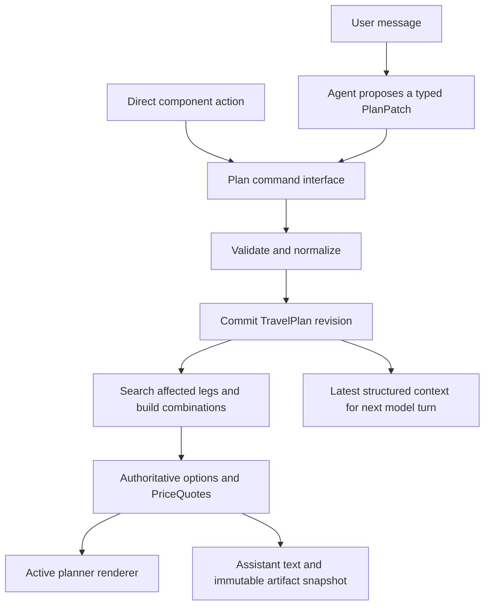

# Interactive conversational travel UI evaluation

> **Updated product decision:** [`browser-local-generative-ui-decision.md`](browser-local-generative-ui-decision.md) supersedes this report's recommendation and scoring rubric for the current demo. The clarified goal prioritizes adaptive visual composition and browser-local fare interaction over a server-owned production travel plan. This report remains the detailed 13-repository survey and record of the earlier full travel-domain analysis.

Checked 2026-10-02.

## Decision

Build the product around an application-owned, revisioned `TravelPlan` and an authoritative search and quote service. Use [assistant-ui](https://github.com/assistant-ui/assistant-ui) for the conversation shell and its native [`present` generative UI](https://www.assistant-ui.com/docs/tools/generative-ui) with a custom travel vocabulary for model-composed layouts. Direct control changes and conversational changes must enter the same validated plan-command path. Direct changes should bypass the model, start the required search immediately, and become visible to the model on the next turn through the latest committed plan revision.

This recommendation does not make assistant-ui the source of itinerary or price truth. The backend owns route feasibility, plan revisions, searches, offer selection, and totals. assistant-ui owns messages, the composer, streamed response presentation, and the constrained component tree. Keep its newer [Interactables](https://www.assistant-ui.com/docs/tools/interactables) optional because the API is marked unstable and custom runtimes must inject stored snapshots into model context correctly. The first version can use stable React callbacks, the application plan store, and backend-loaded context on every turn.

[json-render](https://github.com/vercel-labs/json-render) is the best alternative renderer if a prototype proves that conditions, repeats, computed values, watchers, external-store adapters, or its devtools add enough value. Do not start with assistant-ui `present` and json-render together. They overlap in catalog, schema, action, and state responsibilities.

None of the thirteen repositories supplies the travel domain needed here. They can render and synchronize an interface. The application must still add multi-city and mixed-mode planning, real transfer semantics, quote units, derived totals, date and stay constraints, and conversation-to-plan reconciliation.

## What the requested feature means

The target is an interactive planner embedded in a conversation. It is larger than adding fare cards to an assistant message.

The acceptance scenario used for this report is:

1. A user asks: "Plan Prague to Split next Friday, stay two nights, take a ferry to Hvar for three nights, then fly to Paris. Show the cheapest and fastest plans."
2. The assistant replies with prose and a live itinerary UI in the same response. The UI contains reusable date controls, city and stay controls, a duration view, leg-specific train, bus, ferry, and flight selectors, filters, options, and an itinerary total. A text composer remains at the bottom.
3. The user changes the Split stay from two nights to three, disables flights for the final leg, or selects a different offer directly in the UI. The control updates immediately. The application marks totals stale or pending, searches affected legs, then displays options and totals for the matching plan revision. This path does not require another model turn.
4. The user writes: "Make the first leg faster even if it costs up to EUR 30 more, and show this as a timeline." The assistant reads the latest structured plan, including the direct edits, applies a validated patch, searches the affected leg, and either updates the active surface or creates a new timeline artifact. It does not reconstruct the plan from transcript prose.
5. Earlier assistant cards continue to show the revision they originally described. Using an old proposal requires an explicit restore, activate, or fork action.

"Duration bar" has two useful meanings, and the product should support both without conflating them:

- A trip calendar showing fixed dates, adjustable stay durations, and travel time between stops.
- A visual duration comparison for travel offers, based only on backend-provided durations.

Travel time, total elapsed trip time, and nights spent in cities are separate values. Use total door-to-door movement time as the default "fastest" metric. It includes scheduled travel, transfers, waiting, and defined station, airport, or port access buffers, while excluding intentional city stays. Offer earliest final arrival as a separate objective when that is what the user means. "Cheapest" should compare only complete feasible itineraries whose current `PriceQuote` covers the same travelers, currency policy, taxes, and fees. Fixed trip dates and fixed city stays are hard constraints; explicitly flexible stays may be adjusted by the optimizer. Show the active objective and its assumptions in the UI.

## Product requirements and acceptance checks

| Requirement | Acceptance check |
| --- | --- |
| Reusable date selection | The same semantic date and stay editor can appear in the active planner and in an inline proposal. It enforces date bounds, keyboard access, chronological legs, fixed trip-window constraints, and explicit conflict handling. |
| Duration bar | The UI distinguishes city stays, travel duration, and total elapsed time. Backend values drive every numeric duration. |
| Train, bus, ferry, and flight selector | Every leg has a set of allowed modes. The selector disables infeasible modes rather than fabricating results. Different legs may use different modes. |
| Cities and multi-city planning | Users can add, remove, reorder, and edit cities. `N` ordered stops produce `N - 1` travel legs whose endpoints remain consistent with adjacent stops. |
| Filters | Global and per-leg filters have typed meanings. At minimum they cover objective, modes, direct or transfer policy, price or duration limits, and relevant departure windows. |
| Varying durations | Each city may have its own stay duration or fixed dates. Each offer has its own travel duration. Conflicting edits fail visibly or ask for a constraint choice. |
| Cheapest and fastest options | The backend compares feasible itinerary combinations under the same current plan revision and quote rules. The UI explains the chosen objective and shows ties or tradeoffs. |
| Text and UI in one response | One assistant turn can interleave prose with several coordinated, reusable travel components. |
| Direct live interaction | A control edit commits a new plan revision, starts affected searches, and updates option counts and totals without an LLM round trip. Pending, incomplete, failed, stale, estimated, quoted, and expired states are explicit. |
| Later conversational edits | The next model run receives the latest committed plan revision and quote status. It can update the existing active surface or add a new comparison or visualization. |
| Bottom composer | The conversation has an accessible composer at the bottom with streaming, stop, retry, and error behavior. |
| Alternative layouts | The model may arrange allowlisted semantic components as a timeline, comparison, cards, table, or map plus detail pane. Layout freedom never grants authority over travel data. |
| TypeScript | New domain, tool, catalog, action, and transport boundaries use TypeScript. Existing JSX can migrate when touched rather than through a blocking rewrite. |

The following proposed scenarios turn those requirements into reviewable gates. They describe what a future prototype must prove; they were not run in this research task.

1. A simple city A to city B request returns text, date, mode, filter, and result controls, plus separate cheapest and fastest choices and a provider-defined price total.
2. A plan with at least three cities supports a different mode on each leg, independent city stays, a route or timeline view, and an itinerary price breakdown.
3. A direct date, stay-duration, mode, filter, or selection change requotes only affected legs. The total becomes pending or incomplete, stale responses are rejected, and the edit does not require a model round trip.
4. A follow-up message reads the latest clicked state and can patch the same plan, create a variant, or append a different visualization.
5. Historical cards remain immutable. The active plan remains mutable. Activating or forking an old card is explicit.
6. Streamed partial text and component trees show loading and error states without mounting broken controls or accepting incomplete actions.
7. Reloading the conversation restores messages, active plan revision, historical artifacts, quote freshness, and pending or expired status.
8. Fixed trip windows, stay allocation, overnight travel, time zones, connection feasibility, and unavailable transport modes produce explicit valid results or conflicts.
9. The large interactive workspace works with a keyboard and on mobile. A desktop split pane adapts to a single-column layout without losing the composer or current plan.
10. The implementation may add TypeScript at new boundaries without a Next.js migration or full rewrite, and that choice does not reduce any behavior above.

## Current application baseline

The current demo is useful as a source of visual components and deterministic data. It does not contain a conversational planner.

[`App`](../../src/App.jsx#L11) stores one origin, one destination, a departure date, an optional reversed return date, passengers, one mode, one sort, and pagination. It owns ephemeral local view and request state and performs one abortable GET search at a time. There is no thread, message, artifact, plan revision, agent, model stream, or persistence layer.

[`SearchForm`](../../src/components/SearchForm.jsx#L195) edits exactly one origin and destination pair. It has native departure and optional return date inputs and a passenger selector. [`ResultsPage`](../../src/components/ResultsPage.jsx#L158) separately owns draft search state, one active mode, outbound or return leg selection, a direct-only flag, and one selected result. Its mode tabs, six-date strip, sort selector, result cards, and pagination are real interactive React controls. Mode, date, and sort changes make a new backend request and show current counts or minimum prices.

The existing mode support is narrower than the requested mixed-mode plan. [`api.js`](../../src/api.js#L1) knows train, bus, flight, and ferry, but each normalized fare has one mode and one duration. The response model contains only outbound and optional return arrays. The UI filters the displayed leg to one active mode. Selecting "all" at the API level returns independent single-mode fares; it does not create an itinerary with several transport modes.

The current direct-only control does not prove transfer support. [`normalizeTrip`](../../src/api.js#L50) defaults missing transfer data to zero, while the backend fare response in [`_search_leg`](../../backend/app.py#L294) does not return a transfer or segment field. As a result, the current data makes every displayed fare appear direct.

The backend contract confirms the domain limit. [`backend/README.md`](../../backend/README.md#L43) documents one outbound and optional return search with one origin, destination, date, mode, sort, page, and limit. [`search`](../../backend/app.py#L395) implements the return as the reversed origin and destination. It cannot express ordered stops, independent dates or modes per leg, stays, transfers, or combined itinerary selection.

Price totals also need a new contract. The `passengers` parameter only filters for enough available seats. The backend returns an unchanged `price_cents` and EUR currency for each fare. The documentation does not define whether that fare is per person, per booking, or inclusive of fees. Its `total` field is the count of matching fares, not money. There is no outbound plus return or multi-leg price total. The UI must not infer a booking total by multiplying or summing these values.

The schedules, prices, and seat counts are deterministic synthetic data, as the [README](../../README.md#L1) states. The demo has no live inventory, booking, or purchase transaction. "Realtime" in the target should therefore mean responsive local state plus asynchronous recomputation. It does not mean guaranteed instant live inventory.

### Requirement gap matrix

| Target | Present evidence | Gap |
| --- | --- | --- |
| Reusable dates | Native inputs and a separate six-date results strip | No shared date and stay module, duration editing, fixed-window rules, or multi-leg chronology |
| Four modes | All four modes exist in data and results tabs | One active mode per single leg; no per-leg mode sets or mixed-mode itinerary |
| Cities | Accessible location chooser and a broad location catalog | One origin and destination only |
| Filters | Price and duration sort plus a direct-only toggle | No authoritative transfers, range or time filters, provider filters, or per-leg overrides |
| Cheap and fast | Sort orders and per-mode minimum values | No feasible itinerary combinations, tradeoff comparison, or aggregate objective |
| Live options and totals | Direct UI requests, result counts, minimum price, one selected fare | No plan revision, partial loading states, combined options, or monetary total |
| Conversation | A decorative "Smart planner" tab | No messages, composer, model runtime, tools, or next-turn state |
| Generated layouts | Fixed React tree | No component vocabulary, renderer, generated spec, or action registry |
| Durable state | Local React state | Refresh loses the current work; no historical plan snapshots or conflict checks |

## Authoritative domain and state model

The planner needs one source of truth outside the generated scene. A generated UI document may describe a view of the plan; it must not become the plan itself.



The core contracts are conceptual, not an implementation scaffold:

| Contract | Required fields and rules |
| --- | --- |
| `TravelPlan` | Stable `planId`, monotonic `revision`, travelers, fixed or flexible trip window, objective, ordered stops, `N - 1` legs, global filters, quote status, and selected option references |
| `TripStop` | Stable stop ID, location reference, time zone, fixed or flexible arrival and departure constraints, and stay duration |
| `TravelLeg` | Stable leg ID, adjacent stop IDs, departure window, allowed or preferred modes, per-leg filters, options status, and selected offer ID |
| `TravelOffer` | Stable result-set and offer IDs, one or more ordered segments, operators, mode per segment, offset-aware departure and arrival instants, transfers, availability, and backend duration values |
| `PriceQuote` | Quote and plan IDs, plan and query revision, selected offers, scope, unit basis, traveler breakdown, base fare, taxes and fees, total in minor units, currency, priced time, expiry, and synthetic or live source |
| `PlanPatch` | Expected base revision, idempotency key, typed operations, affected legs, and conflict outcome |
| `ConversationArtifact` | Message and surface IDs, `planId`, historical revision, rendered spec or semantic component references, result-set IDs, and the price timestamp needed to reproduce the old view |

Important invariants belong in the plan service:

- Adjacent stops and legs agree. Removing or reordering a city deterministically rebuilds affected leg references.
- Legs remain chronologically feasible across time zones and overnight travel. Connection buffers and stay durations cannot overlap.
- Fixed trip windows and adjustable stay durations may conflict. The command must reject the edit or return explicit choices instead of silently moving dates.
- Selected offers belong to the current leg, result set, and query revision. An edit invalidates only the affected selections and totals.
- Cheapest and fastest operate on feasible combinations. Travel time and city-stay time remain separate inputs.
- A monetary total exists only when every required leg has a compatible, current quote. The UI must show incomplete, estimated, quoted, or expired state.
- The model cannot supply price, duration, availability, or total values. Generated components receive stable IDs and read verified values from the plan store.
- Async results carry `planId`, plan revision, query revision, and request ID. A response for an older revision cannot overwrite a newer plan.

### Active plan and historical conversation

The product needs two state lifecycles:

1. The active planner is mutable. Direct edits and agent patches create new plan revisions. It may sit in a pinned workspace beside or above the thread, and small live controls may also appear in the latest response.
2. Conversation history is append-only. An assistant card remains attached to the revision it described. An old card can offer "Use this plan" or "Fork from this version," which creates a new current revision or branch.

A chat-only layout is possible, but only the newest plan card should remain active. Repeating fully live planners in every message makes history ambiguous and increases the chance that an edit to an old card changes the current itinerary unexpectedly. A shared active planner plus inline immutable comparisons is the safer default. It still meets the requirement that assistant responses can mix text and UI.

## Direct interaction and next-turn behavior

Direct control changes should use the same command interface as agent tools while skipping the model:

```text
control change
  -> PlanCommand(planId, expectedRevision, commandId, typed patch)
  -> optimistic control state
  -> validated revision N + 1
  -> cancel or supersede affected searches
  -> search and quote with requestId/queryRevision
  -> accept only results matching the active revision
  -> publish options and totals
```

Debouncing is suitable for continuous controls such as a duration slider. Mode buttons, dates, city selection, and offer selection should commit immediately. The client may abort a superseded request, but it must also reject late responses because network cancellation is not a correctness guarantee.

Every new agent run should load the latest committed plan and quote status from the backend. Passing transcript messages alone is insufficient. Direct UI edits may not produce a user text message, and renderer-local state may be absent from model context. The structured context should say which quotes are pending, ready, failed, expired, or superseded so the assistant does not describe stale totals.

## Evaluation method

Each repository receives a 0 to 5 judgment in five categories. The weighted score measures fit for this feature, not overall project quality or a measured benchmark.

- **Composition, 20 percent.** Can a response contain a model-composed tree or several custom travel controls?
- **Shared plan state, 25 percent.** Can UI and agent read and update an addressable plan across turns and versions?
- **Direct repricing, 20 percent.** Can UI actions call application code and refresh results without another model turn?
- **Conversation UX, 15 percent.** Does it provide thread, composer, streaming, cancellation, and message rendering behavior?
- **React adoption, 20 percent.** How clear and maintainable is adoption for a React application with a Python data service?

`0` means absent, `1` indirect or research-only, `2` substantial bespoke work, `3` documented extension plus application wiring, `4` strong mechanisms with moderate wiring, and `5` first-class. Scores are rounded to whole numbers out of 100.

| Repository | Intended role | C | S | R | U | I | Score / 100 |
| --- | --- | ---: | ---: | ---: | ---: | ---: | ---: |
| [`CopilotKit/generative-ui`](https://github.com/CopilotKit/generative-ui) | Pattern guide and example index | 1 | 1 | 1 | 1 | 1 | **20** |
| [`CopilotKit/CopilotKit`](https://github.com/CopilotKit/CopilotKit) | Full agent and frontend framework with shared state | 4 | 5 | 4 | 5 | 3 | **84** |
| [`assistant-ui/assistant-ui`](https://github.com/assistant-ui/assistant-ui) | React assistant shell, runtimes, tools, and constrained composition | 5 | 4 | 4 | 5 | 4 | **87** |
| [`vercel/ai`](https://github.com/vercel/ai) | Low-level model, tool, and UI stream SDK | 3 | 2 | 4 | 4 | 4 | **66** |
| [`tambo-ai/tambo`](https://github.com/tambo-ai/tambo) | Generative interface runtime with persistent interactables | 3 | 5 | 4 | 5 | 3 | **80** |
| [`langchain-ai/agent-chat-ui`](https://github.com/langchain-ai/agent-chat-ui) | Complete Next.js client for LangGraph | 2 | 3 | 2 | 4 | 2 | **51** |
| [`Chainlit/chainlit`](https://github.com/Chainlit/chainlit) | Python conversation framework and managed or custom frontend | 2 | 3 | 3 | 4 | 2 | **55** |
| [`a2ui-project/a2ui`](https://github.com/a2ui-project/a2ui) | Declarative UI protocol and multi-platform renderers | 4 | 3 | 3 | 2 | 3 | **61** |
| [`ag-ui-protocol/ag-ui`](https://github.com/ag-ui-protocol/ag-ui) | Agent-to-frontend event and state transport | 1 | 5 | 2 | 3 | 3 | **58** |
| [`vercel-labs/json-render`](https://github.com/vercel-labs/json-render) | Catalog-constrained component-tree runtime | 5 | 3 | 4 | 3 | 4 | **76** |
| [`GenerativeUI/GenerativeUI.github.io`](https://github.com/GenerativeUI/GenerativeUI.github.io) | Whole-page generation research and examples | 2 | 1 | 1 | 1 | 0 | **20** |
| [`ant-design/x`](https://github.com/ant-design/x) | AI chat design system and stream SDK | 3 | 3 | 2 | 5 | 3 | **62** |
| [`thesysdev/openui`](https://github.com/thesysdev/openui) | Declarative UI language, renderer, state, queries, and chat | 5 | 4 | 4 | 5 | 3 | **83** |

AG-UI's low composition score is not a protocol defect. Rendering is deliberately outside its role. The Google Research project and the standalone CopilotKit guide also score low because they are references rather than installable runtimes.

## Repository-by-repository evaluation

### 1. CopilotKit/generative-ui

This repository clearly separates controlled UI, declarative UI, and open-ended generated HTML. That vocabulary helps choose the trust boundary for the travel planner. It also points to current CopilotKit, A2UI, and MCP Apps examples.

It is a guide, not a package, chat shell, state store, or renderer. It cannot implement the feature by itself. Use its controlled and declarative patterns, then adopt the main CopilotKit packages or another runtime. [Source](https://github.com/CopilotKit/generative-ui)

Application work remains the entire planner, component catalog, command path, quote service, persistence, and UI shell.

### 2. CopilotKit/CopilotKit

CopilotKit is the strongest full agent framework in the set. It provides chat and headless UI, frontend tools, AG-UI streaming, A2UI surfaces, and reactive shared app-agent state. The documented [`agent.setState()` path](https://docs.copilotkit.ai/shared-state) lets direct UI changes become readable agent state and agent updates rerender React. This closely matches a page-aware planner.

Its thread and state persistence still have a boundary. Rich event replay depends on a server-side store or managed persistence; framework text checkpoints alone do not guarantee replay of tool UI and attachments. The application should keep `TravelPlan` and quotes in its own database and map chat thread, agent checkpoint, and plan IDs explicitly. [Thread lifecycle](https://docs.copilotkit.ai/deepagents/threads-lifecycle), [self-managed persistence](https://docs.copilotkit.ai/pydantic-ai/threads-self-managed)

CopilotKit still needs the travel catalog, plan commands, Python service integration, authorization, revision guards, and quote rules. Use A2UI only if declarative interoperability or multiple clients are real needs; fixed frontend tools cover a more controlled first release.

### 3. assistant-ui/assistant-ui

assistant-ui supplies the best balanced UI layer. It has thread, message, composer, tool, attachment, branch, cancel, retry, and runtime primitives. Tool UI handles developer-authored cards. Its native [`present`](https://www.assistant-ui.com/docs/tools/generative-ui) path emits one nested component tree from a custom vocabulary, and the [renderer](https://www.assistant-ui.com/docs/api-reference/generative-ui/rendering) supports recursive children, stable keys, streaming status, and actions. The [ActionRegistry](https://www.assistant-ui.com/docs/api-reference/generative-ui/actions) dispatches generated `$action` references into registered application handlers. One response can arrange a date and duration bar, city stays, leg cards, filters, offer comparisons, and totals under one layout root without executing generated JavaScript.

[`ExternalStoreRuntime`](https://www.assistant-ui.com/docs/runtimes/custom/external-store) lets the application retain message storage and callbacks. Interactables offer bidirectional versioned component state, but the feature is unstable. Stored Interactable metadata is not useful to the model unless the custom backend injects and formats it. The safer first version loads `TravelPlan` on every run and maps generated actions to typed plan commands.

The application must validate every component and action at the domain boundary. The top-level generated tree schema guides the model but does not make component props or fare values authoritative. A price-bearing node should accept quote IDs and plan revisions, not arbitrary numbers.

### 4. vercel/ai

The Vercel AI SDK is a clean low-level controlled-rendering and streaming option. Its [generative interface guide](https://ai-sdk.dev/docs/ai-sdk-ui/generative-user-interfaces) maps typed tool parts to application React components. One message can contain text and several tool calls. Client tools, `addToolOutput`, stop, regeneration, and resumable streams cover the model and tool lifecycle.

It does not supply a complete chat product, a component-tree catalog, durable threads, or shared plan state. Host React state does not automatically enter the next model turn. The app must build or adopt a shell, persist messages, inject the plan, and add a renderer for alternative model-composed layouts. [Message persistence](https://ai-sdk.dev/docs/ai-sdk-ui/chatbot-message-persistence)

This is a strong ingredient in a lean assembly, especially with json-render. It should not reduce the requested feature to a fixed series of cards.

### 5. tambo-ai/tambo

Tambo directly addresses persistent conversational components. A generated component is inserted into a message, while a mounted [Interactable](https://docs.tambo.co/concepts/generative-interfaces/interactable-components) is addressable and updateable by the agent. [`useTamboComponentState`](https://docs.tambo.co/concepts/generative-interfaces/component-state) exposes user changes to later turns and restores them with the thread.

The documented generative lifecycle creates one component instance per message. That is not fatal: a composite `ItineraryWorkspace` can contain all the reusable controls, and separate generated components can present immutable comparisons. It offers less clearly documented arbitrary nested custom composition than assistant-ui, json-render, or OpenUI.

Tambo requires a decision about its agent loop, identity, thread/runtime service, and overlapping state model. Keep the authoritative plan outside component props. Use one mounted persistent workspace and historical generated summaries rather than making each new message the active plan.

### 6. langchain-ai/agent-chat-ui

Agent Chat UI is a complete Next.js client for a LangGraph server. It supplies message streaming, thread history, tools, multimodal content, inbox flows, and a developer-authored artifact pane. LangGraph can checkpoint a structured travel plan, and Python is a natural backend language. [Source](https://github.com/langchain-ai/agent-chat-ui)

The repository does not offer a reusable component catalog or a general model-composed tree. The active artifact can host an itinerary workspace, but browser-to-graph commands, direct repricing, plan revisions, and stale-response protection are application work.

Choose it only if the product intentionally adopts Next.js and LangGraph. It is a forkable application architecture rather than an incremental library for the current Vite client.

### 7. Chainlit/chainlit

Chainlit is a Python-first conversation framework. A message can contain several elements and actions. A named [CustomElement](https://docs.chainlit.io/api-reference/elements/custom) can update props, invoke a Python action, or send a user message. `callAction` gives direct controls a path to Python without another model turn. The separate [React client](https://docs.chainlit.io/deploy/react/overview) supports a custom frontend.

Its managed CustomElement environment uses JSX with restricted imports and its own shadcn and Tailwind assumptions. Existing components and CSS do not transfer unchanged. It provides controlled composite elements rather than a model-authored nested catalog. Persistence is off by default, and message history is not a revisioned travel plan. [Persistence](https://docs.chainlit.io/data-persistence/overview)

Chainlit is viable when Python ownership and an embeddable copilot matter more than reuse of the current React tree. The app still needs the entire plan, quote, versioning, and component-composition layer.

### 8. a2ui-project/a2ui

A2UI is a safe declarative protocol for remote agents and multiple clients. A trusted catalog constrains component names. `createSurface`, component and data-model updates, bindings, and actions support incremental interactive surfaces. The project provides React and several mobile or web renderers. [Protocol](https://github.com/a2ui-project/a2ui/blob/main/specification/v0_9_1/docs/a2ui_protocol.md), [roadmap](https://github.com/a2ui-project/a2ui/blob/main/docs/public/roadmap.md)

The basic catalog is too generic for city stays, itinerary legs, mode matrices, duration views, offers, and quote totals. Those need a custom catalog. A2UI also does not provide thread storage, a fare cache, or a travel plan. Sending a surface data model to the agent is useful but does not make it authoritative or durable.

Use A2UI when the same agent surface must work in web and native clients or cross an organizational boundary. It is more protocol work than a single React product needs initially.

### 9. ag-ui-protocol/ag-ui

AG-UI is a bidirectional event protocol for run lifecycle, streamed messages and tool calls, state snapshots and patches, activities, and custom events. It is a strong transport for a remote or long-running agent and a good way to synchronize a plan reference and activity state. [Overview](https://github.com/ag-ui-protocol/ag-ui/blob/main/docs/introduction.mdx), [state](https://github.com/ag-ui-protocol/ag-ui/blob/main/docs/concepts/state.mdx)

It intentionally does not draw cards, forms, timelines, or travel controls. Pair it with controlled React, A2UI, OpenUI, json-render, or another renderer. Direct repricing commands, search cancellation, state authority, and persistence remain application decisions.

Use it when reconnection, streaming agent runs, or shared remote state justify a protocol. It is unnecessary for a simple request and response agent service.

### 10. vercel-labs/json-render

json-render is the strongest standalone constrained renderer in this set. An application defines a schema-backed catalog and a React registry. The generated JSON tree supports state binding, conditions, templates, computed values, repeats, slots, validation, actions, watchers, and several external-store adapters. Watchers and registered actions can call the plan service when bound values change. The stream integration can keep text and UI parts together. [Source](https://github.com/vercel-labs/json-render), [React guidance](https://github.com/vercel-labs/json-render/blob/main/skills/react/SKILL.md)

It does not define thread semantics, a travel domain, or durable agent-visible state. Local renderer edits need an application handler that commits a plan revision. The host must include that revision in the next run. It is pre-1.0 and should sit behind a local adapter with pinned versions.

Use it with an assistant shell or AI SDK when richer renderer logic and devtools justify a separate composition engine. With assistant-ui, choose json-render instead of native `present`, not alongside it by default.

### 11. GenerativeUI/GenerativeUI.github.io

The Google Research project demonstrates whole-page HTML, CSS, and JavaScript generation and provides the paper, examples, and PAGEN browser. It shows that generated layouts can be much richer than Markdown. [Project](https://generativeui.github.io/), [paper](https://generativeui.github.io/static/pdfs/paper.pdf)

The repository is an academic website, not an installable React runtime. It publishes no trusted component catalog, state-sync contract, thread store, action bridge, or durable plan mechanism. Generated JavaScript may be interactive, but that is not an auditable source for current fares, constraints, or totals.

Use it as inspiration for optional destination stories, maps, and explainers. Do not use it for the authoritative fare workflow.

### 12. ant-design/x

Ant Design X provides a substantial conversation design system: bubbles, messages, sender and composer, conversations, attachments, Markdown, reasoning and progress views, and a streaming request SDK. Its newer `x-card` work is described as an A2UI-based dynamic card renderer with data binding and reactive updates. [Source](https://github.com/ant-design/x), [`XRequest`](https://x.ant.design/x-sdks/x-request/)

The current `x-card` package documentation and higher-level release descriptions do not yet present one settled custom-catalog workflow. More importantly, adopting X means adopting Ant Design 6 as the product design foundation. It still does not provide a travel plan, quote store, or automatic next-turn visibility of host state.

Choose it only with an intentional Ant Design migration and a version-specific spike that proves custom registration, action dispatch, binding, and streamed update behavior.

### 13. thesysdev/openui

OpenUI is the strongest single-ecosystem alternative. It combines a constrained component library, streamed OpenUI Lang, React rendering, chat options, reactive variables, persisted renderer state, incremental editing, and application-owned queries and mutations. A bound state change can rerun a registered query without another model call. Inline mode interleaves text and UI, while edit mode can update an existing program. [Reactive state](https://www.openui.com/docs/openui-lang/reactive-state), [queries and mutations](https://www.openui.com/docs/openui-lang/queries-mutations), [headless chat](https://www.openui.com/docs/api-reference/react-headless)

The tool provider must still call the real plan and quote service. Renderer state should not become the fare ledger. The host must decide when edit mode updates the active surface and when a new immutable artifact is appended. It must also reject stale search responses.

OpenUI reduces the number of separate packages but makes its language, parser, runtime, and evolving package set a central product dependency. Its documented language is currently v0.5. Choose it when reactive generated workflows are worth that commitment.

## Complete solution options

### Option 1: assistant-ui native composition plus the plan and quote service

This is the recommended starting architecture.

- Use assistant-ui for the thread, messages, bottom composer, streaming and tool states, retry, cancellation, and an active artifact or planner pane.
- Define a small custom `present` vocabulary of semantic travel components. Generated trees reference `planId`, revision, leg IDs, offer IDs, and quote IDs.
- Map `$action` handlers to typed plan commands. A direct action commits and searches without calling the model.
- Load the latest plan into every model run. Treat generated UI in past messages as immutable revision snapshots.
- Keep Interactables optional until their unstable interface and custom context-injection path prove useful.

This option uses one conversation and composition engine. It provides the full text plus dynamic multi-component UI requirement without arbitrary code generation.

### Option 2: OpenUI plus the plan and quote service

Use OpenUI's React and headless chat packages, a semantic travel library, reactive queries, mutations, persistence hooks, inline mode, and edit mode. Map every query and mutation to the same plan-command service.

This is attractive when the generated UI needs rich reactive behavior after generation. It has the largest single-platform commitment and requires the team to treat OpenUI Lang as a core dependency.

### Option 3: CopilotKit with controlled tools and shared state

Use CopilotKit's chat or headless UI, frontend tools, and shared agent state. Store a compact current plan reference and editable view state in shared state, while the backend database owns the full plan and quotes. Add A2UI only if cross-platform declarative surfaces become a requirement. AG-UI comes with the wider agent architecture.

This is the best option for a page-aware, long-running agent. It has more identity, persistence, runtime, and authorization work than the recommended UI-focused design.

### Option 4: Tambo persistent workspace

Mount one interactable composite `ItineraryWorkspace` as the active surface. Use generative message components for frozen comparisons, diffs, or receipts. Map component state and tools to the plan service rather than making Tambo props authoritative.

This can produce a convincing conversational planner quickly. It also commits the application to Tambo's agent, identity, thread, and persistence model, and its one-generated-instance-per-message lifecycle offers less free composition than the leading options.

### Option 5: Vercel AI SDK plus json-render

Use the AI SDK for provider abstraction, typed tools, message parts, streaming, and cancellation. Use json-render for the constrained travel catalog, direct actions, bound state, and alternative layouts. Build or adopt the surrounding thread shell and composer.

This gives clean low-level control and a powerful renderer. It requires more product-shell and persistence work than assistant-ui, but avoids adopting a full agent framework. It is a good option for a team that wants to own its conversation experience.

## Semantic component vocabulary

Keep the model vocabulary narrow and travel-specific:

- `ItineraryWorkspace`, the active composite surface keyed by plan ID.
- `DateStayBar`, the trip calendar and editable city stays.
- `CityStay`, one city, date constraints, and nights.
- `LegDurationBar`, backend travel time and visual comparison.
- `ModeSelector`, allowed train, bus, ferry, and flight modes for a leg.
- `FilterBar`, global or per-leg objective and constraints.
- `OfferComparison`, backend-selected cheapest, fastest, and balanced candidates.
- `TripOption`, one stable backend offer.
- `PriceSummary`, quote status, unit basis, fees, currency, total, and expiry.
- `PlanDiff`, a readable account of a revision change.
- `PlanReceipt`, a frozen historical summary.

Components that display authoritative data should accept stable identifiers and selectors into the plan store. The model may choose layout and explanatory text. It may not pass arbitrary price, duration, availability, city, or mode values that bypass validation.

## TypeScript migration decision

Migrate incrementally. A full rewrite is not a prerequisite for research or the first prototype.

Start TypeScript at the boundaries where an invalid shape would cause the most damage:

1. Travel plan, patch, offer, quote, artifact, and status contracts.
2. Plan command client and backend response validation.
3. Agent tool schemas and generated component catalog.
4. Action registry and renderer adapters.
5. Conversation transport and stored-message format.

Existing visual components can remain JSX while wrapped by typed adapters, then migrate when their props change. Runtime validation remains necessary because model output, network responses, and stored artifacts cross system boundaries. TypeScript alone does not validate them.

## Phased evidence plan

No implementation was performed for this evaluation. If the team prototypes the recommendation, use evidence gates that test the product behavior instead of framework demos.

### Phase 1: domain and direct interaction proof

- Define the plan and quote contracts, price unit semantics, revision rules, and synthetic-data labels.
- Extend the backend conceptually to accept ordered stops and leg criteria and to return structured segments and quotes.
- Prove one direct city, date, stay, mode, filter, and offer edit through the same command path.
- Force an older search to finish after a newer edit and verify it cannot overwrite the current revision.

### Phase 2: controlled conversation

- Add the assistant shell and bottom composer.
- Support typed `create_plan`, `patch_plan`, `search_legs`, and `select_offer` tools.
- Render developer-authored workspace and comparison components in one response with text.
- Verify that a direct UI edit is present in the next model turn without generating a synthetic user message.

### Phase 3: constrained composition

- Add the custom semantic vocabulary and three layouts: timeline, comparison, and map plus details.
- Verify schema rejection, unknown component rejection, action authorization, keyboard behavior, responsive layout, and streaming partial trees.
- Compare assistant-ui native composition with json-render only if the native renderer lacks a concrete required behavior.

### Phase 4: multi-city and quote integrity

- Test three or more cities, different modes on adjacent legs, overnight travel, unavailable modes, fixed-window conflicts, time zones, and partial failures.
- Verify cheapest and fastest against an independent deterministic calculation.
- Verify passenger basis, fees, currency rules, expiry, incomplete totals, and selected-offer invalidation.

### Phase 5: history and recovery

- Reload a thread and recover the active plan and historical artifacts.
- Edit an older message and verify the conversation and plan branch deliberately.
- Restore an old plan snapshot without mutating the original historical card.
- Test retry, cancellation, reconnect, duplicate command IDs, and concurrent tabs.

## Completion audit

| Explicit request | Covered in this report |
| --- | --- |
| Evaluate each of the prior 13 repositories | Scoring table and 13 individual evaluations |
| Reusable date selection | Product requirements, domain model, semantic vocabulary, prototype gates |
| Duration bar | Dual interpretation, acceptance checks, `DateStayBar` and `LegDurationBar` |
| Ferry, bus, train, and flight selector | Per-leg allowed modes, feasibility rules, `ModeSelector` |
| Cities and filters | Ordered stops, global and per-leg filters, component vocabulary |
| Multi-city, mixed transport, varying durations | Acceptance scenario, plan invariants, backend and Phase 4 requirements |
| Cheap and fast options | Objective semantics, feasible-combination rule, `OfferComparison` |
| Interactive UI inside text and UI chat responses | Acceptance scenario, assistant-ui recommendation, repository comparison |
| Direct UI changes with live options and totals | Direct command flow, async revision guards, quote states |
| Next message edits or creates interactive elements | Latest structured context, active surface versus immutable artifacts |
| Text composer at the bottom | Product requirement and assistant-shell options |
| Alternative layouts | Constrained semantic layouts and Phase 3 comparison |
| TypeScript migration is acceptable | Incremental TypeScript decision and boundary order |
| No implementation | This document contains evaluation, contracts, and proposed evidence only |

## Sources

The broad repository, status, license, and mechanism survey remains in [`generative-ui-resources.md`](generative-ui-resources.md). This companion report uses the primary sources linked in each evaluation and the live local implementation cited in the baseline. Context7 successfully confirmed current CopilotKit, assistant-ui, and Vercel AI SDK APIs. Context7 `resolve-library-id` was attempted for json-render, OpenUI, and A2UI; all three returned `Invalid API key`, so those entries were verified against current official repositories and first-party documentation instead. No Context7 configuration was changed.
